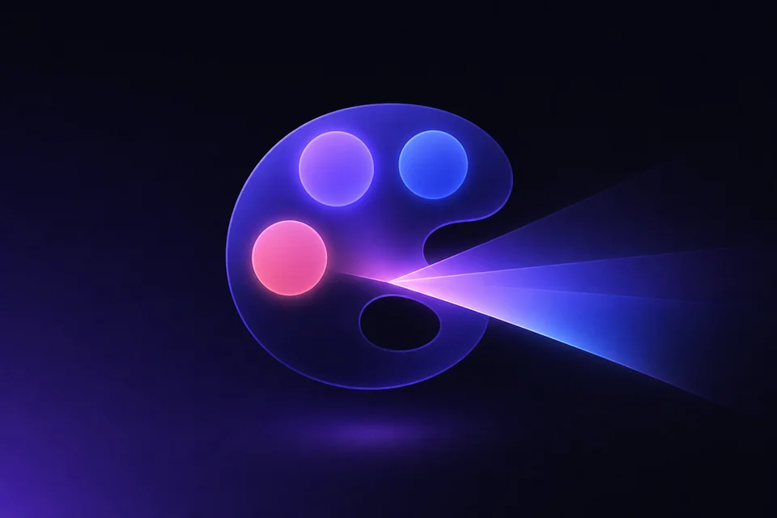
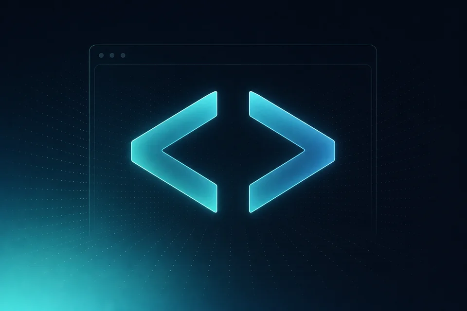
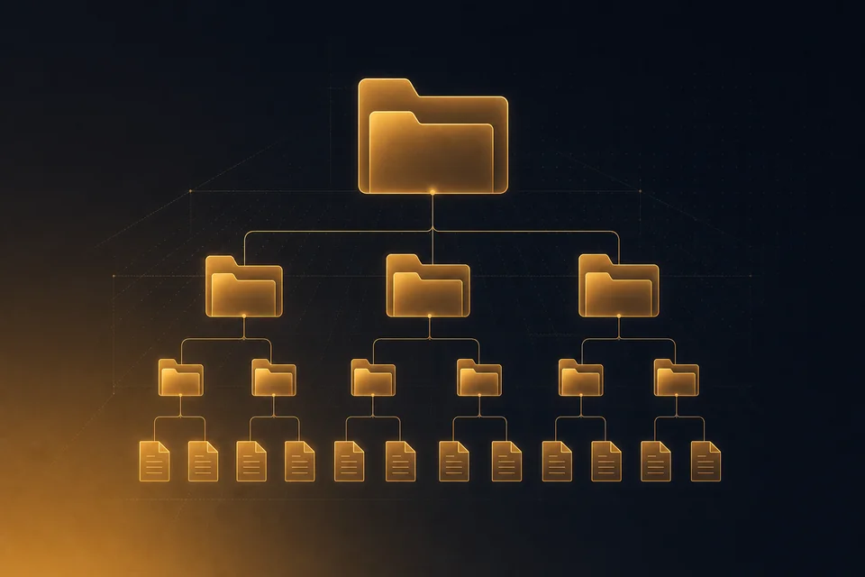

<div align="center">

# IndieArk Skills

**为一切 AI 协作 Agent 打造的「八件套」生产级 Skills。**

`图` · `片` · `网` · `视` · `搜` · `办` · `构` · `写` — 一字一格，一格一件。

[](./LICENSE)
[](#八件套--已起步)
[](#八件套--已起步)
[](#八件套--预览)
[](https://agentskills.io)

[安装](#安装) · [协同关系](#协同关系) · [详细介绍](#详细介绍) · [兼容性](#兼容性) · [什么是 Skill](#什么是-skill) · [维护](#发布维护者指南)

</div>

---

## 八件套 · 已起步

> 4 件已落地，分别处于 `beta` / `router-alpha` / `alpha` 阶段——能跑、可被 agent 加载，但未到正式发布。各件真实状态以下方详情卡为准。

<table>
<tr>
<td width="50%" align="center" valign="top">
  <a href="#image-gen-pro"></a>
  <p><a href="#image-gen-pro"><b>image-gen-pro</b></a> · <code>图</code><br/>
  <sub>图像生成 / 编辑 / 透明 / 批量</sub></p>
</td>
<td width="50%" align="center" valign="top">
  <a href="#ppt-gen-pro"></a>
  <p><a href="#ppt-gen-pro"><b>ppt-gen-pro</b></a> · <code>片</code><br/>
  <sub>演示文稿 / Slide Deck</sub></p>
</td>
</tr>
<tr>
<td width="50%" align="center" valign="top">
  <a href="#html-gen-pro"></a>
  <p><a href="#html-gen-pro"><b>html-gen-pro</b></a> · <code>网</code><br/>
  <sub>HTML / 网页 / Landing</sub></p>
</td>
<td width="50%" align="center" valign="top">
  <a href="#video-gen-pro"></a>
  <p><a href="#video-gen-pro"><b>video-gen-pro</b></a> · <code>视</code><br/>
  <sub>视频导演（当前适配器：Seedance 2.0）</sub></p>
</td>
</tr>
</table>

## 八件套 · 预览

<table>
<tr>
<td width="25%" align="center" valign="top">
  <a href="#search-pro"></a>
  <p><a href="#search-pro"><b>search-pro</b></a> · <code>搜</code><br/>
  <sub>检索 / 抓取 / 下载 / 转换</sub></p>
</td>
<td width="25%" align="center" valign="top">
  <a href="#office-pro"></a>
  <p><a href="#office-pro"><b>office-pro</b></a> · <code>办</code><br/>
  <sub>办公接入 + 数据分析</sub></p>
</td>
<td width="25%" align="center" valign="top">
  <a href="#struct-pro"></a>
  <p><a href="#struct-pro"><b>struct-pro</b></a> · <code>构</code><br/>
  <sub>文件夹 / 代码 / 文档治理</sub></p>
</td>
<td width="25%" align="center" valign="top">
  <a href="#write-pro"></a>
  <p><a href="#write-pro"><b>write-pro</b></a> · <code>写</code><br/>
  <sub>各类内容写作编排</sub></p>
</td>
</tr>
</table>

> `preview` = `v0.1.0-skeleton`。SKILL.md / skill.json / references/ 路由完备，可被 agent 加载；CLI 与下游执行链按各私库 `plans/00x` 节奏推进。

---

## 协同关系

八件套设计上是**正交工具集** — 每件单装可用，互不依赖。**唯一显式的跨件关系**是 [`write-pro`](#write-pro) 在 router 边界外声明的 hand-off：

| 写完后需要⋯ | → hand-off 到 |
|---|---|
| 出 deck | [`ppt-gen-pro`](#ppt-gen-pro) |
| 出网页 | [`html-gen-pro`](#html-gen-pro) |
| 多渠道发布（飞书 / Notion / 公众号 / 邮件） | [`office-pro`](#office-pro) |
| 找资料 / 抓素材 | [`search-pro`](#search-pro) |

每件 skill 自身的真实下游依赖：

| Skill | 调度的外部能力 |
|---|---|
| `image-gen-pro` | OpenAI image API / GPT Image 2 / Codex CLI 委托 |
| `video-gen-pro` | Volcengine Ark · Seedance 2.0 API（当前唯一适配器；多供方落地后即为 provider-neutral 形态） |
| `ppt-gen-pro` | **router 委托** → `ppt-image-first` / `guizang-ppt-skill` / `ppt-master` 三家外部 extension |
| `html-gen-pro` | **router 委托** → `ui-ux-pro-max` / `taste-skill` 两家外部 extension |
| `search-pro` | `smart-search-cli` · `scrapling` · `agent-browser` · `yt-dlp` · `pandoc` · `ffmpeg` · `imagemagick` |
| `office-pro` | 全局 40+ `lark-*` 子 skill（飞书 OpenAPI） |
| `struct-pro` | 文件系统操作（默认 dry-run） |
| `write-pro` | 全局 9 个 `pro-*` 方法论原子（`copy`/`exp`/`explain`/`idea`/`must`/`rule`/`struct`/`summary`/`test`） |

> 创作四件（`图/片/网/视`）之间**不互相调用**；只是 `_work/html_runs/` · `_work/image_gen_runs/` · `_work/seedance_upload/` 这类本地留痕目录的命名风格保持对齐。

---

## 详细介绍

### `image-gen-pro` · 图
<a id="image-gen-pro"></a>


> 把"想出一张图"和"真的拿到那张图"之间的所有杂事一口气吃掉。

`beta` · `v0.1.0-beta.29` · CLI: `imagen`

- **三路由覆盖** — API key / Codex CLI 委托 / placeholder dry-run，agent 环境差异不卡壳
- **18 类别 80+ 模板** — `references/` 内置，海报 / UI / 信息图 / 漫画即取即用
- **图生图 + 编辑 + 透明 PNG + 批量 manifest** — 同一套 CLI 一站式

→ [skill 目录](./image-gen-pro) · [SKILL.md](./image-gen-pro/SKILL.md) · [README](./image-gen-pro/README.md)

---

### `ppt-gen-pro` · 片
<a id="ppt-gen-pro"></a>


> 做 PPT 这件事，路由 / 模板 / 内容编排得分开做，比一锅塞给 agent 稳得多。

`router-alpha` · `v0.1.0`

- **router-only** — L1 路由判定（按受众 / 平台 / 风格）+ deck 大纲 / 故事板规划在本仓完成，**渲染委托给外部 extension**
- 已注册 3 路 extension：[`ppt-image-first`](https://github.com/NyxTides/ppt-image-first) · [`guizang-ppt-skill`](https://github.com/op7418/guizang-ppt-skill) · [`ppt-master`](https://github.com/hugohe3/ppt-master)
- 仓内不含原生 PPT 渲染器，也不打包 extension 代码（按需 `git clone` 到本地 `extensions/`，不入仓）

→ [skill 目录](./ppt-gen-pro) · [SKILL.md](./ppt-gen-pro/SKILL.md)

---

### `html-gen-pro` · 网
<a id="html-gen-pro"></a>


> 让 AI 写网页不止"能跑就行"——而是设计系统先行的可演进产物。

`router-alpha` · `v0.2.0`

- **router-only** — L1 路由判定 + 5 轴视觉 critique + 反 AI slop 方法论由 router 把关，**渲染委托给外部 extension**
- 已注册 2 路 extension：[`ui-ux-pro-max`](https://github.com/nextlevelbuilder/ui-ux-pro-max-skill)（landing / app / style-mockup） · [`taste-skill`](https://github.com/Leonxlnx/taste-skill)（style-mockup，含 brutalist / soft 子 skill）
- 严格边界：不做 PPT slides / 不做纯 UI 审计 / 不做后端或 CLI / 不做纯方法论问答

→ [skill 目录](./html-gen-pro) · [SKILL.md](./html-gen-pro/SKILL.md) · [README](./html-gen-pro/README.md)

---

### `video-gen-pro` · 视
<a id="video-gen-pro"></a>


> 把镜头脚本与 API 拉起合成一层，让 agent 真的能"拍片"。

`alpha` · `v0.4.2` · CLI: `seedance2`

- **导演工作流** — natural-language 镜头拆解 → scene card → 多段连续性规划 + tail-frame hand-off
- **当前适配器**：Volcengine Ark · Seedance 2.0（`doubao-seedance-2-0-260128` / `*-fast`），仓内目前只有这一个适配器实现
- **包名向后兼容**：实际安装目录仍是 [`seedance2-video-pro/`](./seedance2-video-pro)，CLI 仍是 `seedance2`；待二供方接入后才把顶层入口收敛到 `video-gen-pro`

→ [skill 目录](./seedance2-video-pro) · [SKILL.md](./seedance2-video-pro/SKILL.md) · [README](./seedance2-video-pro/README.md)

---

### `search-pro` · 搜
<a id="search-pro"></a>


> 「拿不到信息」这件事不该把 agent 卡住——智能路由 + 5 条下游执行链。

`preview` · `v0.1.0-skeleton`

- **5 条 L1 路线** — search-web / crawl-static / crawl-render / download-media / convert-format
- 下游覆盖 `smart-search-cli` · `scrapling` · `agent-browser` · `yt-dlp` · `pandoc` · `ffmpeg` · `imagemagick`
- 按目标可用性 / JS 渲染 / 登录态智能选下游

→ [skill 目录](./search-pro) · [SKILL.md](./search-pro/SKILL.md) · [路由表](./search-pro/references/router.md)

---

### `office-pro` · 办
<a id="office-pro"></a>


> 飞书自动化与数据分析合到同一个调度层，agent 不再两头跑。

`preview` · `v0.1.0-skeleton`

- **双主路线** — `office-connect`（飞书优先）+ `data-analysis`（探索→清洗→统计→可视化→报告）
- 编排全局 40+ `lark-*` 子 skill，**不复制**底层 OpenAPI 正文
- 凭据本地 env，不入仓库

→ [skill 目录](./office-pro) · [SKILL.md](./office-pro/SKILL.md) · [路由表](./office-pro/references/router.md)

---

### `struct-pro` · 构
<a id="struct-pro"></a>


> 不是验证器、不是一次性审计——是 agent 日常用的"打扫房间"工具。

`preview` · `v0.1.0-skeleton`

- **三条主线** — `folder-tidy` / `code-structure` / `doc-structure`
- **默认非破坏性 dry-run**；破坏性动作显式 opt-in；跨仓 `mv` 已锁
- **三受众文档矩阵** — AI 记忆 / AI 阅读 / 人类阅读

→ [skill 目录](./struct-pro) · [SKILL.md](./struct-pro/SKILL.md) · [路由表](./struct-pro/references/router.md)

---

### `write-pro` · 写
<a id="write-pro"></a>


> 反 AI slop 的第一防线 + 个人风格 prompt 优先，写作不再像 ChatGPT 默认体。

`preview` · `v0.1.0-skeleton`

- **4 条 L1 路线** — long-form / short-form / commercial-copy / engineering-doc
- **反 AI slop 强制 critique** — draft → final 之前必须列出 **≥ 3 条不可替换的差异化记忆点**
- 调度全局 9 个 `pro-*` 方法论原子（不复制原子正文，按路线映射）

→ [skill 目录](./write-pro) · [SKILL.md](./write-pro/SKILL.md) · [路由表](./write-pro/references/router.md)

---

## 安装

> 当前面向 Windows / PowerShell 工作站。其他平台走 [手动复制](#手动复制) 或 [Git Submodule](#git-submodule)。

### PowerShell 一键

```powershell
git clone https://github.com/indieark/indieark-skills.git
cd indieark-skills
.\install.ps1                  # 仅安装 skill
.\install.ps1 -InstallCli      # 同时安装 imagen / seedance2 CLI wrapper
```

安装目标默认：

| 类型 | 默认路径 |
|---|---|
| Skill | `$env:USERPROFILE\.codex\skills\<name>\` |
| CLI wrapper | `$env:LOCALAPPDATA\Microsoft\WindowsApps\<name>.cmd` |

### 手动复制

```powershell
Copy-Item -Recurse .\image-gen-pro $env:USERPROFILE\.codex\skills\   # Codex CLI
Copy-Item -Recurse .\image-gen-pro .\.claude\skills\                 # Claude Code
Copy-Item -Recurse .\image-gen-pro .\.agents\skills\                 # Cursor / 通用
```

### Git Submodule

```powershell
git submodule add https://github.com/indieark/indieark-skills.git vendor/indieark-skills
New-Item -ItemType SymbolicLink -Path ".codex\skills\image-gen-pro" -Target "vendor/indieark-skills/image-gen-pro"
```

### 更新

```powershell
.\update.ps1                   # git pull --ff-only + 重装
.\update.ps1 -InstallCli       # 同时刷新 CLI wrapper
```

---

## 兼容性

| Agent / Runtime | Skill 安装位置 | 状态 |
|---|---|---|
| **Codex CLI** | `$env:USERPROFILE\.codex\skills\<name>\` | ✅ 主要测试目标 |
| **Claude Code** | `.claude/skills/<name>/` 或 `~/.claude/skills/` | ✅ 兼容（手动复制） |
| **Cursor** | `.agents/skills/<name>/` | ✅ 兼容（手动复制） |
| **Claude.ai (web)** | Settings → Capabilities → Skills | ✅ 兼容（上传 `.zip`） |

> `SKILL.md` 是跨 agent 的可移植格式；只要你的 agent 支持 Agent Skills 规范，把文件夹放到它扫描的目录即可识别。

---

## 什么是 Skill

一个 **Skill** 是 agent 按需加载的自包含文件夹：

```text
<skill-name>/
├── SKILL.md      ← 必需：何时使用 + 怎么使用（YAML frontmatter + 指令）
├── README.md     ← 给人看的文档
├── skill.json    ← 元信息（version / cli / 路由 / 阻塞项）
├── references/   ← 可选：agent 按需加载的扩展文档
├── scripts/      ← 可选：确定性可执行脚本
└── assets/       ← 可选：模板、字体、图片
```

agent 是否激活某个 skill，由 frontmatter 的 `description` 决定——所以 description 就是你和 agent 之间的契约。完整规范见 [agentskills.io](https://agentskills.io) 与 [`anthropics/skills`](https://github.com/anthropics/skills)。

---

## 发布维护者指南

私库工作区中，本仓库应放在 `C:\Vibe_Coding\IndieArk\indieark-skills`，与开发源 `C:\Vibe_Coding\IndieArk\skills` 平级。

```powershell
.\publish.ps1 -SourceRoot ..\skills    # 从私库刷新 runtime（会覆盖各 skill 目录）
.\install.ps1 -WhatIf                  # 干跑验证
git status --short ; git diff --stat
```

`manifest.json` 的 `status` 字段（与各 skill 自身 `skill.json` 同步）：

- `beta` — 仓内含可执行实现 + CLI，处于迭代细化（如 `image-gen-pro`）
- `router-alpha` — 仓内只做路由 + 规划，渲染层委托给外部 extension（如 `ppt-gen-pro` / `html-gen-pro`）
- `alpha` — 仓内含首个适配器实现，未来扩展为 provider-neutral（如 `video-gen-pro`，当前物理包名 `seedance2-video-pro`）
- `preview` — `v0.1.0-skeleton`，可被 agent 加载，CLI 与下游链未就位（如 `search-pro` / `office-pro` / `struct-pro` / `write-pro`）

新增 skill 流程见各私库的 `plans/<编号>-new-skill-<name>.md`。

---

## License

[Proprietary](./LICENSE) © IndieArk
