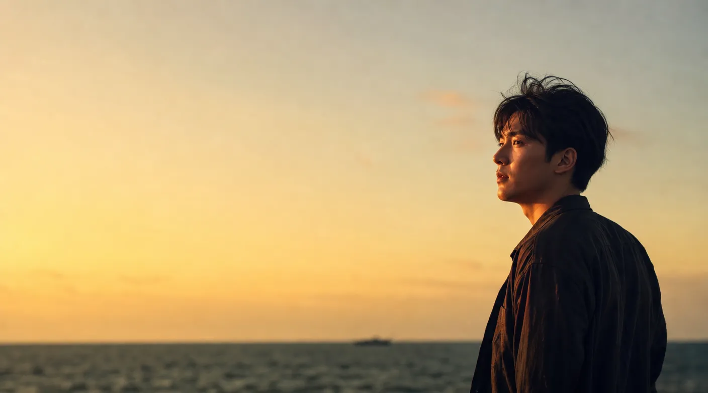
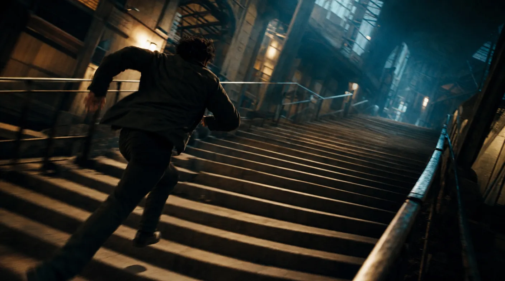
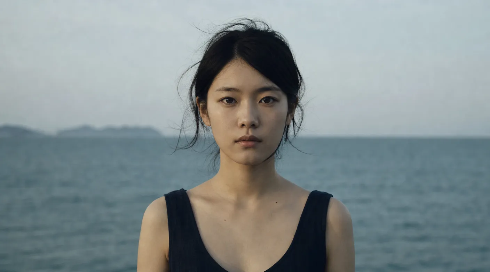

# Composition 构图 / 机位角度填法

> Load when: 要填导演法【画面内容】的构图子字段（主体放哪、画面平衡、机位高低方位），或故事板法每格的构图，需要知道各构图与机位的画面语言效果、什么剧情该选哪个、怎么写进 prompt。
> Avoid: 要定取景远近与景深（去 `shot-scale.md`）、镜头怎么动（去 `camera-move.md`）、或整片风格基调（去 `style-core.md`）。
> Pairs with: `../../../video-gen-director/references/director-method.md` 定义【画面内容】有哪些槽位，本文件管构图与机位角度怎么填；`shot-scale.md` 管景别与焦点、`camera-move.md` 管运镜，三者正交叠加；`../../../video-gen-storyboard/references/storyboard-board.md` 画母图每格也用本文件定构图。

构图决定视线往哪走、主体放在哪、画面是否平衡；机位角度是镜头相对被摄体的高低与方位，直接改变观众与主体的「权力关系」和代入方式。两者都管「主体在画框里怎么摆、从什么方位看」，与景别正交（同一景别可有不同构图与机位）。本文件按「选项 → 画面语言效果 → 选用判据 → prompt 写法」展开构图与机位角度各项。

> 写法约定：Seedance 是中国模型，可仅用中文提示词。本文件正文与示例 prompt 一律中文，英文术语仅在少数处作括注（供外部图像/视频工具识别，非必需）。`media/composition/` 下配同名 gif/png 供人工对照镜头效果（运镜类 gif 参考自 Runway Gen-4.5 镜头库实测，三分法/对角线/平视为构图示意图）。

## 构图

构图决定视线往哪走、主体放在哪、画面是否平衡。它和景别正交：同一景别可有不同构图。每项按「画面语言效果 → 选用判据 → prompt 写法」展开。

### 三分法（rule of thirds）

- 画面语言效果：主体放在九宫格四个交叉点之一，画面自然平衡、有呼吸感，是最稳妥的通用构图。
- 选用判据：拿不准构图时的默认值；人物面部、地平线放在三分线上几乎不会错。
- prompt 写法：`三分法构图，<主体>置于画面<左/右>三分点，<视线/留白方向>`。
  - 例：`三分法构图，人物置于画面右三分点，目光望向左侧留白，海平面压在下三分线`。

### 中心构图（center / symmetrical）

- 画面语言效果：主体居中或左右镜像对称，制造庄重、仪式感、稳定或刻意的"规整美"（韦斯·安德森式）。
- 选用判据：要威严/仪式/秩序感，或刻意营造工整到略不安的氛围时用；正反打对话慎用（易呆板）。
- prompt 写法：`中心对称构图，<主体>居中，左右元素镜像平衡，<风格>`。
  - 例：`完美中心对称构图，人物立于楼梯正中拾级而上，两侧装饰镜像，电影感`。

### 引导线（leading lines）

- 画面语言效果：用道路、建筑、光线等线条把视线导向主体，强化纵深与方向感。
- 选用判据：要观众的视线"被牵着走"向某个主体或灭点、或强调纵深时用。
- prompt 写法：`引导线构图，<道路/线条>延伸引导视线至<主体>，强透视纵深`。
  - 例：`引导线构图，蜿蜒海岸公路延伸引导视线至远处行驶的巴士，黄昏暖光`。

### 框架式（frame within frame）

- 画面语言效果：用门、窗、拱、树枝等在画面内再造一个"框"套住主体，增加层次、窥视感或隔离感。
- 选用判据：要营造窥探、隔阂、封闭，或给主体加一层视觉重点时用。
- prompt 写法：`框架式构图，透过<门/窗/拱>看向<主体>，前景框暗、主体亮`。
  - 例：`框架式构图，透过半开木门看向室内孤坐的人，门框暗、室内暖光`。

### 负空间（negative space）

- 画面语言效果：主体周围大量留白/空旷，强调孤立、渺小、规模或情绪的"空"。
- 选用判据：要表达孤独、渺小、辽阔、留白的情绪张力时用。
- prompt 写法：`负空间构图，<主体>极小置于画面一角，大面积<环境/留白>包围`。
  - 例：`负空间构图，俯拍盐湖，红色吉普极小行驶于大片空旷白色湖面，强调渺小`。

### 对角线（diagonal）

- 画面语言效果：主体或主线沿对角线排布，带来动感、不稳定、张力，区别于水平的平静。
- 选用判据：要动势、冲突、失衡感（追逐、坠落、对峙）时用。
- prompt 写法：`对角线构图，<主体/动线>沿画面对角延伸，动感强烈`。

## 机位角度

机位角度是镜头相对被摄体的高低与方位，直接改变观众与主体的"权力关系"和代入方式。

### 平视（eye level）

- 画面语言效果：镜头与主体视线齐平，中性、客观、平等，最不带评判。
- 选用判据：常规对白、客观叙事的默认角度。

### 高角度俯拍（high angle）

- 画面语言效果：镜头从上往下看主体，主体显得渺小、脆弱、被压制。
- 选用判据：要让角色显弱势、被困、或交代群体队形/调度时用。
- prompt 写法：`高角度俯拍，镜头自上方俯视<主体>，主体显渺小`。

### 低角度仰拍（low angle）

- 画面语言效果：镜头从下往上看主体，主体显得高大、威严、有压迫感或英雄感。
- 选用判据：要塑造强势、威胁、崇高时用（反派登场、英雄定格）。
- prompt 写法：`低角度仰拍，镜头自下方仰视<主体>，主体显高大威严`。

### 鸟瞰 / 顶视（bird's eye / top-down）

- 画面语言效果：正上方垂直俯视，把空间抽象成图案，制造上帝视角的疏离或秩序感。
- 选用判据：要展示队形、路径、几何图案，或全知疏离感时用。

### 虫眼 / 极低仰视（worm's eye）

- 画面语言效果：极低位向上看，制造极端的高耸、压迫或被困（如坑底望天）。
- 选用判据：极端压迫/仰望的特殊情绪镜。

### 过肩（over the shoulder）

- 画面语言效果：从一方肩后拍向另一方，建立"谁在看谁"的对话关系与空间轴线。
- 选用判据：对白正反打的主力角度；建立两人对峙/交流的方位关系。
- prompt 写法：`过肩镜头，从<A>肩后越过看向<B>，<B>清晰<A>虚化`。

### 主观视角 POV（point of view）

- 画面语言效果：呈现角色眼睛所见，强代入，观众"成为"角色。
- 选用判据：要极致代入、模拟角色感知（恐惧、探索、第一人称动作）时用。
- prompt 写法：`第一人称主观视角POV，模拟<角色>所见，<手/动作>从画面下方入画，轻微呼吸晃动`。

### 航拍（aerial / drone）

- 画面语言效果：高空俯拍或飞行轨迹，展现地理规模、史诗感、宏大调度。
- 选用判据：建立镜头、规模展示、段落转场。
