# Style Core 画风 / 风格核心填法

> Load when: 要定整片画风——填导演法【氛围与画质】的风格核心（整片不变的最底层基调，是什么质感的世界、哪个题材流派），或设定流的视觉圣经，需要可挑选的风格模板和「抽象词→可见元素」的翻译。
> Avoid: 要定用什么器材/画幅拍的（去 `visual-tone.md`）、随段落微调的色彩与影调（去 `lighting-tone.md`）、单镜时间/氛围 token（去 `scene-tokens.md`）、或景别构图运镜（去 `shot-scale.md` / `composition.md` / `camera-move.md`）。
> Pairs with: `../../../video-gen-director/references/director-method.md`【氛围与画质】定义有哪些子字段，本文件管整片不变的风格核心填什么；视觉基调拆在 `visual-tone.md`、随段落微调的色彩与影调拆在 `lighting-tone.md`；`../../../video-gen-assets/references/setting-director.md` 的视觉圣经/Style Bible 是设定流里的一步，本库是它的展开模板池。

风格核心是横切两种方法论的填法知识：导演法在【氛围与画质】填，故事板法定整片风格，设定流的视觉圣经引用。它定「这是个什么质感的世界」——写实、2D 还是 3D，哪个题材流派，画面像什么材质，是整片几乎不变的最底层基调。本文件提供可挑选的风格模板库（即梦官方 94 风格），并给出把抽象词翻译成可见元素的规则。器材/画幅层面的视觉基调拆在 `visual-tone.md`，随段落微调的色彩与影调拆在 `lighting-tone.md`。

## Style Bible 翻译规则

风格规则必须把抽象词翻译成可见元素，不能只写“高级感/电影感”这类抽象词：

```text
风格：<题材/平台>，<画幅>，<主色调>，<光线方向>，<材质>，
<镜头速度>，<景深/颗粒/质感>，<声音或节奏倾向>。
```

示例：

```text
9:16 竖屏短剧，暗童话悬疑，低饱和红与冷绿，门内暖光和门外冷光对比，
木门粗糙纹理，浅景深，缓慢推近，轻微胶片颗粒，安静到危险逼近。
```

这套「抽象词 → 可见元素」翻译对应导演法【氛围与画质】的两个**整片不变**子字段：风格核心、视觉基调。第三层「色彩与影调」随段落微调，模板池拆在 `lighting-tone.md`；「氛围基调」随剧本变，不固定进风格模板。

<!-- 下方「风格核心模板池」收录字节系即梦官方风格库 94 个具名风格，分类与排序逐字对齐即梦风格库的官方三个 tab（真人 / 2D / 3D），配官方渲染封面（media/style-core/ 已 gitignore，仅本地参考）。每个风格用「中文风格名」直接当 prompt 锚点（Seedance 是中国模型，吃中文），三段式给「适用题材 → 可见元素 → prompt 写法」的成套翻译，挑一个粘进【氛围与画质】的「风格核心」。视觉基调模板池在本文件后半，整片不变。 -->

## 风格核心模板池（即梦官方 94 风格）

风格核心定「这是个什么质感的世界」——写实、2D 还是 3D，哪个题材流派，画面像什么材质。它是整片几乎不变的最底层基调，定了之后色彩与影调只在它内部微调。

风格名直接是 prompt 锚点：Seedance 吃中文，把官方中文风格名整词写进【氛围与画质】的「风格核心」即可触发，再用「可见元素」补足细节、「prompt 写法」给成套句式。下列**分类与排序逐字对齐即梦风格库的官方三个 tab——真人 / 2D / 3D**，每个风格配官方渲染封面（仅本地参考，不入库）。注意几个反直觉的官方归类：橙黄/荒诞高调白/蓝橙/紫色四个「色调电影」官方归**真人**（是统一调色的实拍风格，不是独立色调层）；中国神话官方归 **2D**（插画神话，非真人史诗）；复古 Y2K 奇幻官方归 **3D**（立体渲染奇幻，非实拍）。

### 一、真人写实类（35，官方「真人」tab）

实拍/摄影质感的电影与剧集流派。题材决定调色与年代，质感方向统一是「真人实景、照片级、杜绝 CG 塑料感」。

#### 复古科幻原子朋克

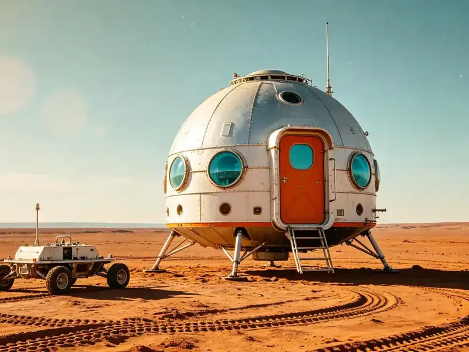

- 适用题材：复古未来科幻、末世废土、太空时代怀旧叙事。
- 可见元素：1950-60 年代原子时代设计、流线型复古机械、暖橙冷蓝高对比、胶片颗粒、复古乌托邦质感。
- prompt 写法：`复古科幻原子朋克风格，原子时代流线型设计，复古暖橙冷蓝高对比，胶片颗粒，真人实景质感`。

#### 宫斗权谋冷峻风格

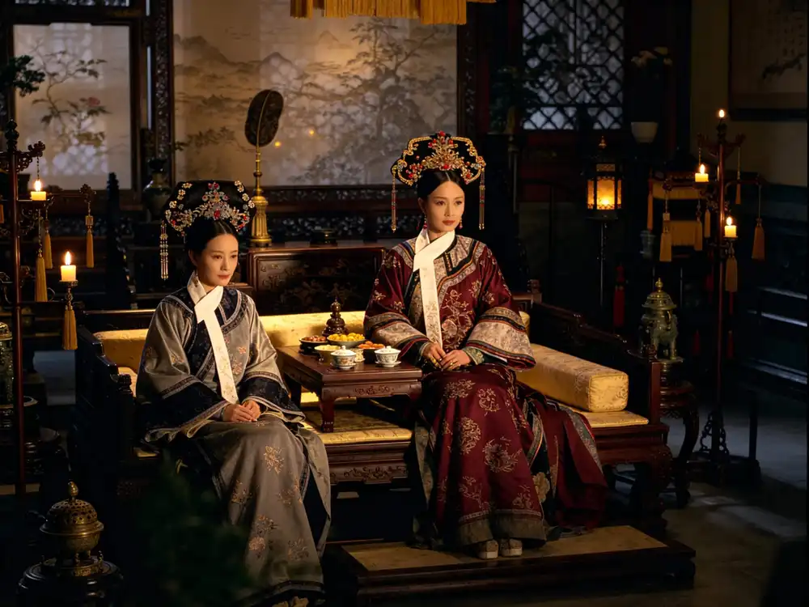

- 适用题材：宫廷权谋、古装大女主、深宫悬疑。
- 可见元素：冷峻低饱和、烛光暖点缀冷暗环境、繁复宫装与陈设、阴翳布光、压抑张力。
- prompt 写法：`宫斗权谋冷峻风格，低饱和冷调，烛光暖点缀，阴翳布光，繁复宫装陈设，压抑张力，真人实景`。

#### 国产悬疑冷调

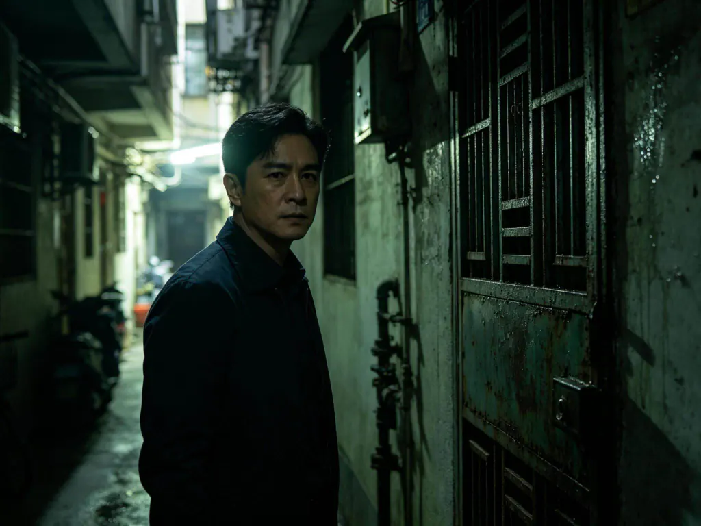

- 适用题材：国产刑侦、都市悬疑、犯罪叙事。
- 可见元素：冷青蓝灰主调、低对比阴郁、写实街景与室内、克制布光、纪实感。
- prompt 写法：`国产悬疑冷调，冷青蓝灰主调，阴郁低对比，写实纪实质感，克制布光，真人实景`。

#### 古偶唯美柔光

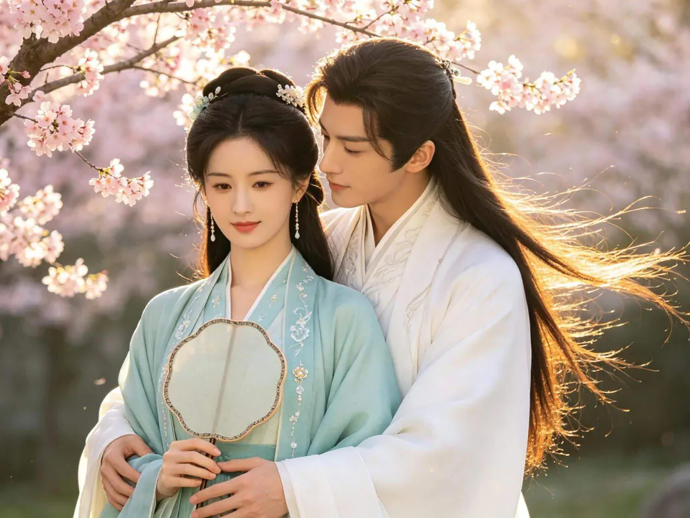

- 适用题材：古装偶像剧、仙侠爱情、唯美言情。
- 可见元素：柔光高光晕、粉白暖调、浅景深虚化、飘逸服化、梦幻柔焦。
- prompt 写法：`古偶唯美柔光，柔焦高光晕，粉白暖调，浅景深虚化，飘逸古装，梦幻氛围，真人实景`。

#### 日式青春胶片

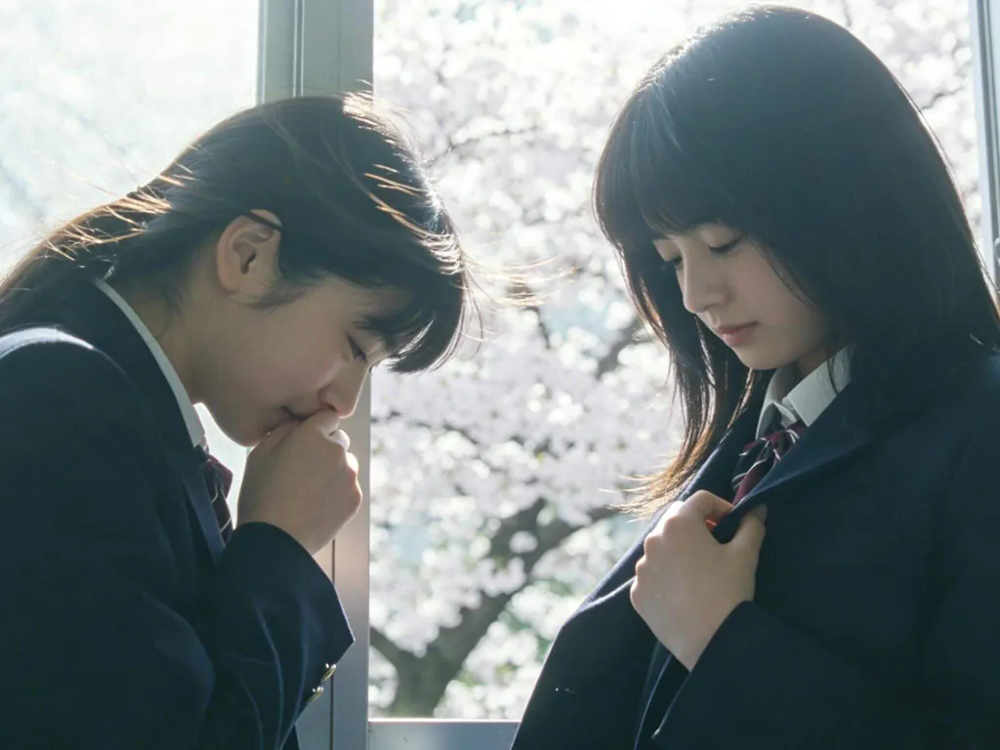

- 适用题材：日系青春、校园爱情、清新文艺短片。
- 可见元素：自然柔光、清新低饱和、35mm 胶片颗粒、生活化构图、淡雅通透。
- prompt 写法：`日式青春胶片，自然柔光，清新低饱和，35mm 胶片颗粒，生活化构图，淡雅通透`。

#### 日式生活自然

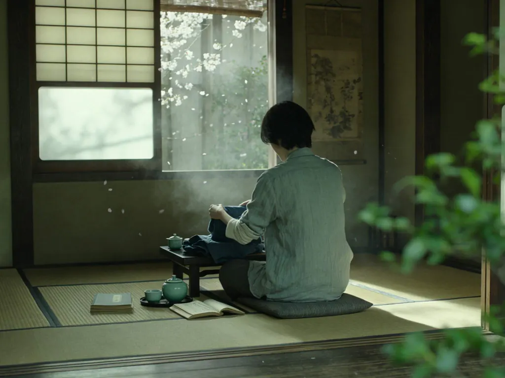

- 适用题材：日剧生活流、家庭日常、治愈写实。
- 可见元素：自然光、真实生活场景、低对比柔和、不加修饰的纪实感、温润色调。
- prompt 写法：`日式生活自然主义，自然光，真实生活场景，柔和低对比，温润纪实质感`。

#### 韩剧都市柔光

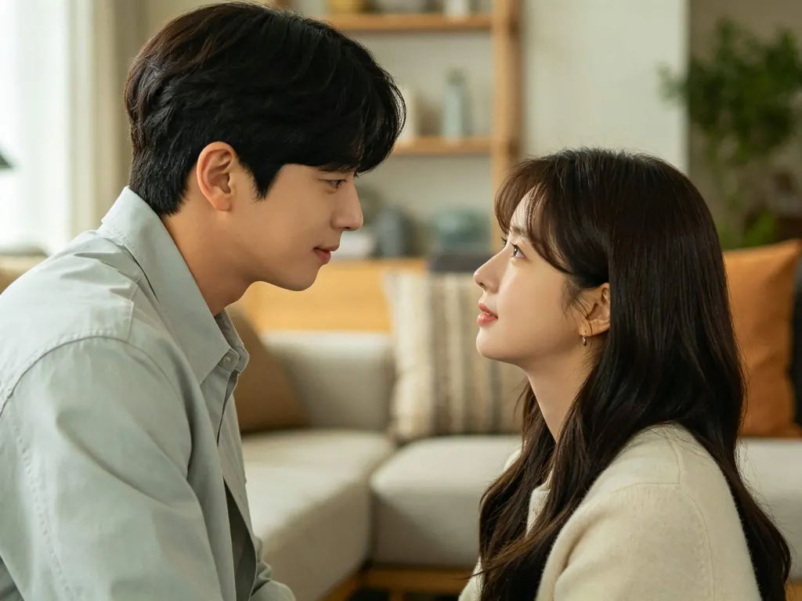

- 适用题材：韩剧都市爱情、时尚职场、现代言情。
- 可见元素：通透柔光、高级灰冷调、精致妆造、浅景深、干净时尚质感。
- prompt 写法：`韩剧都市柔光，通透柔光，高级灰冷调，浅景深，精致时尚质感，真人实景`。

#### 国产都市写实

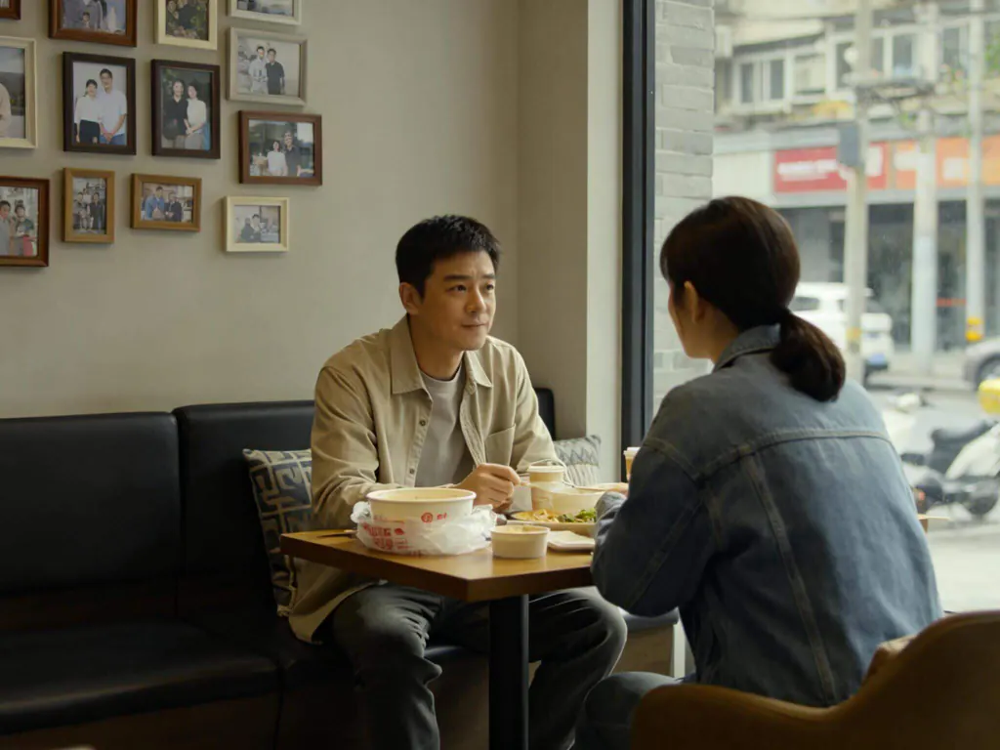

- 适用题材：国产都市剧、现实题材、生活正剧。
- 可见元素：自然写实布光、贴近生活的色调、真实都市场景、中性纪实感。
- prompt 写法：`国产都市写实，自然写实布光，贴近生活色调，真实都市场景，纪实质感`。

#### 武侠江湖写实摄影风格

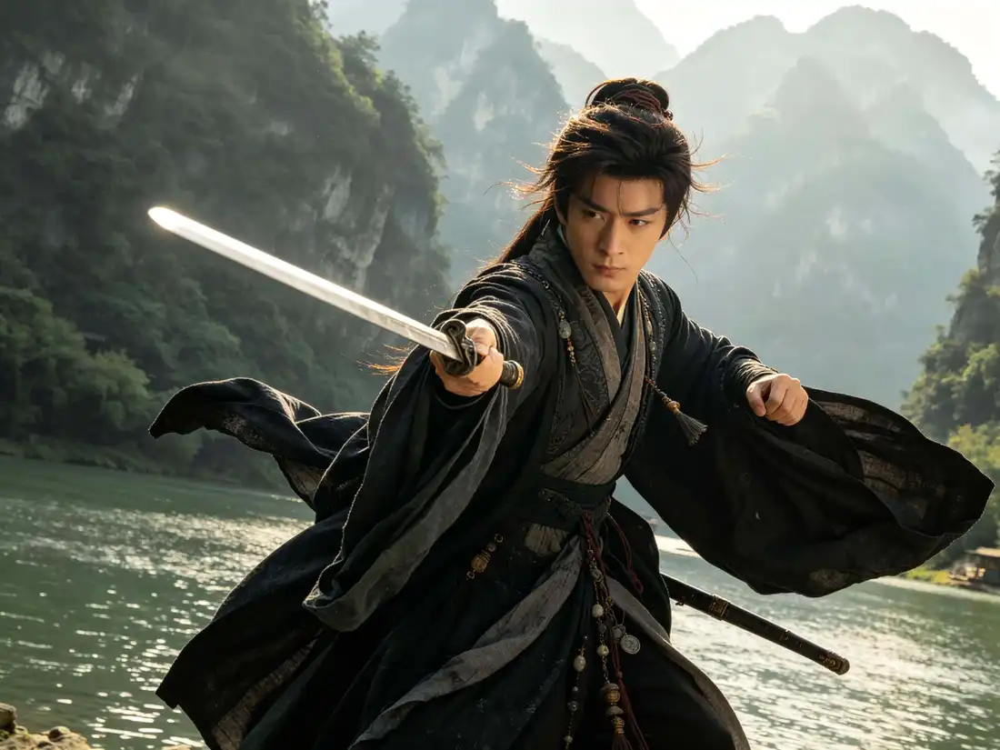

- 适用题材：写实武侠、江湖恩仇、历史武戏。
- 可见元素：苍劲质感、烟尘风沙、低饱和冷暖、自然外光、厚重历史感。
- prompt 写法：`武侠江湖写实摄影，苍劲质感，烟尘风沙，低饱和冷暖，自然外光，厚重历史感，真人实景`。

#### 90 年代写实电影风格

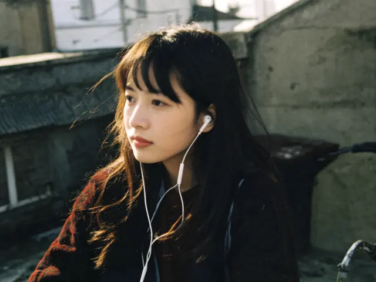

- 适用题材：90 年代年代戏、怀旧叙事、世纪末写实。
- 可见元素：90 年代胶片质感、偏暖泛黄、轻微颗粒与暗角、年代陈设、朴素写实。
- prompt 写法：`90 年代写实电影风格，胶片质感，偏暖泛黄，轻微颗粒暗角，年代陈设，朴素写实`。

#### 复古叙事电影风格

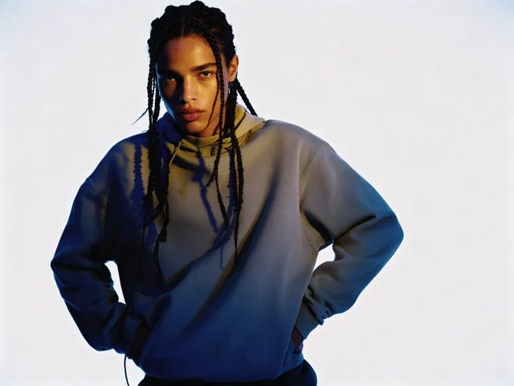

- 适用题材：复古文艺片、年代叙事、怀旧情感长片。
- 可见元素：复古暖调、柔和胶片质感、考究构图、低对比、叙事性布光。
- prompt 写法：`复古叙事电影风格，复古暖调，柔和胶片质感，考究构图，低对比，叙事性布光`。

#### 美式复古好莱坞

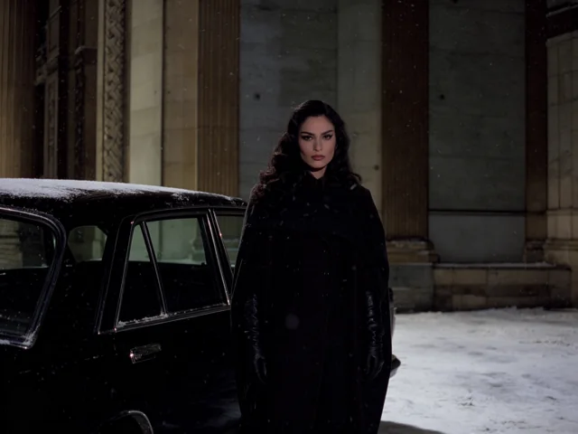

- 适用题材：黄金时代好莱坞、复古美式、华丽年代戏。
- 可见元素：高光泽布光、华丽暖金调、经典三点打光、精致妆造、戏剧性质感。
- prompt 写法：`美式复古好莱坞，高光泽布光，华丽暖金调，经典三点打光，戏剧性质感，真人实景`。

#### 霓虹赛博电影风格

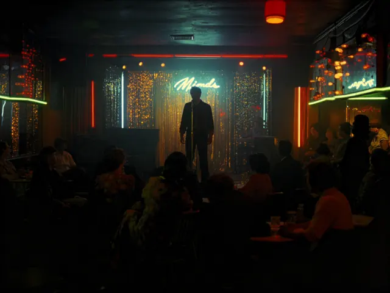

- 适用题材：赛博都市、科幻夜戏、氛围向短片。
- 可见元素：霓虹招牌、雨后反光街道、青品红强对比、暗部迷离、机械义体氛围。
- prompt 写法：`霓虹赛博电影风格，霓虹招牌与雨后反光街道，青品红强对比，暗部迷离，《银翼杀手》氛围，真人实景`。

#### 90 年代中国农村电影风格

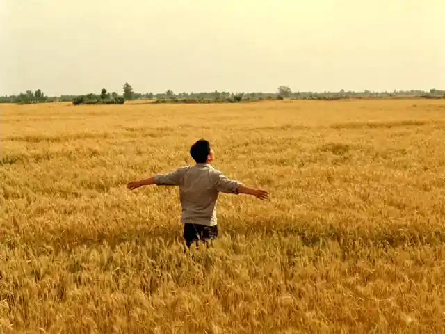

- 适用题材：乡土年代戏、90 年代农村、怀旧乡村叙事。
- 可见元素：泛黄暖土调、自然外光、朴素乡村陈设、胶片颗粒、纪实生活感。
- prompt 写法：`90 年代中国农村电影风格，泛黄暖土调，自然外光，朴素乡村陈设，胶片颗粒，纪实生活感`。

#### 中式暖调蓝辉风格

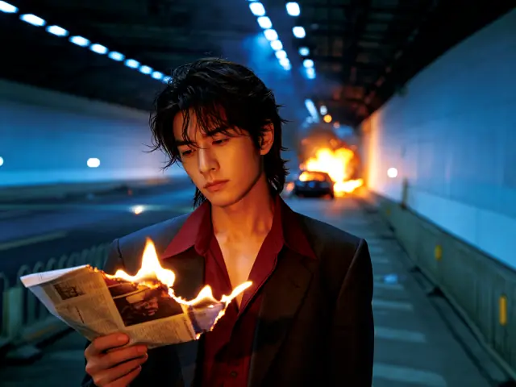

- 适用题材：中式情感剧、暖调家庭戏、温情叙事。
- 可见元素：暖橙主调点缀冷蓝辉光、温润布光、柔和对比、中式生活场景。
- prompt 写法：`中式暖调蓝辉风格，暖橙主调点缀冷蓝辉光，温润布光，柔和对比，中式生活场景，真人实景`。

#### 老式工业影视风格

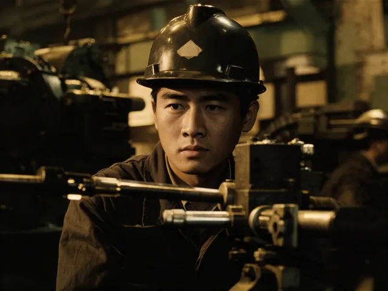

- 适用题材：工业年代戏、工厂时代、硬朗写实。
- 可见元素：冷硬金属灰、厂房机械、低饱和、粗粝质感、硬光投影。
- prompt 写法：`老式工业影视风格，冷硬金属灰，厂房机械，低饱和，粗粝质感，硬光投影，真人实景`。

#### 日本黑白胶片摄影风格

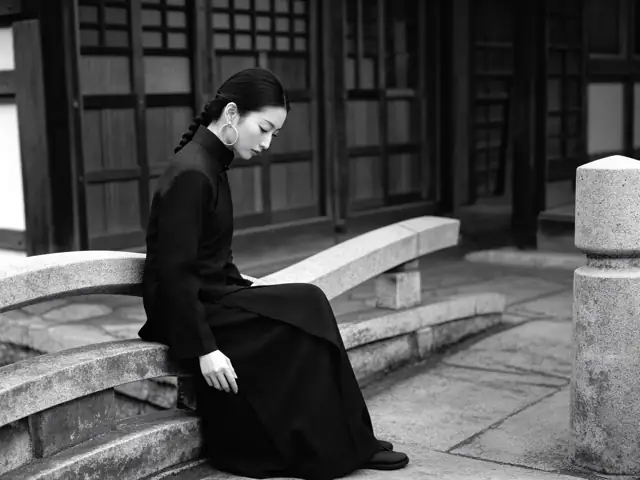

- 适用题材：日系黑白文艺、纪实摄影、极简艺术片。
- 可见元素：黑白胶片、丰富灰阶、自然颗粒、克制构图、静谧文艺感。
- prompt 写法：`日本黑白胶片摄影，黑白胶片，丰富灰阶，自然颗粒，克制构图，静谧文艺感`。

#### 韩国冷淡风电影风格

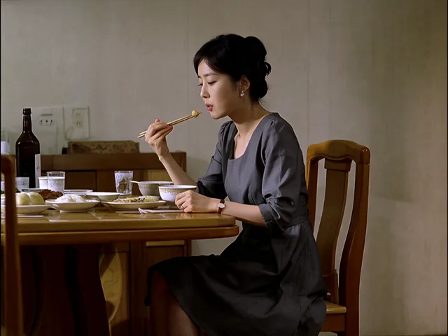

- 适用题材：韩式冷淡文艺、极简都市、疏离情感片。
- 可见元素：冷灰极简、留白构图、低饱和、自然散光、疏离克制氛围。
- prompt 写法：`韩国冷淡风电影风格，冷灰极简，留白构图，低饱和，自然散光，疏离克制氛围，真人实景`。

#### 荒野电影风格

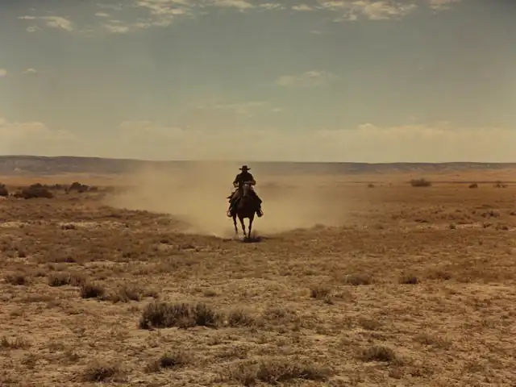

- 适用题材：荒野求生、公路片、自然史诗。
- 可见元素：广袤自然外景、自然天光、大地色调、粗粝质感、苍茫纵深。
- prompt 写法：`荒野电影风格，广袤自然外景，自然天光，大地色调，粗粝质感，苍茫纵深，真人实景`。

#### 橙黄色电影风格

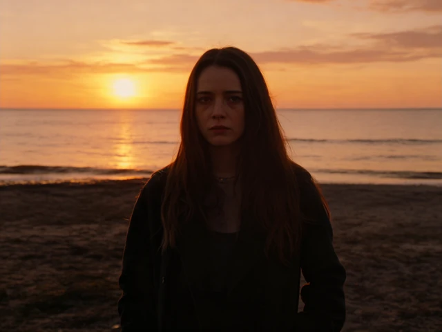

- 适用题材：怀旧暖调电影、夕照时光、温情年代戏。
- 可见元素：整片橙黄统调、暖金高光、低饱和暖土、柔和对比、怀旧胶片质感。
- prompt 写法：`橙黄色电影风格，整片橙黄统调，暖金高光，低饱和暖土，柔和对比，怀旧胶片质感，真人实景`。

#### 复古战争电影风格

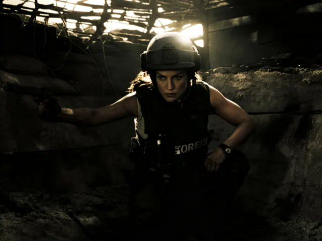

- 适用题材：战争年代戏、历史战役、硬核军事。
- 可见元素：低饱和土褐冷绿、烟尘硝烟、粗粝胶片、自然硬光、厚重历史质感。
- prompt 写法：`复古战争电影风格，低饱和土褐冷绿，烟尘硝烟，粗粝胶片，自然硬光，厚重历史质感`。

#### 恐怖电影风格

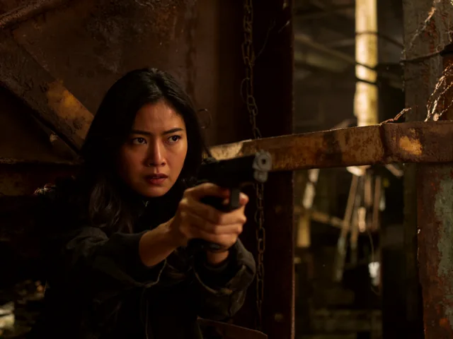

- 适用题材：恐怖惊悚、悬疑惊吓、暗黑叙事。
- 可见元素：高反差暗调、阴影包裹、冷绿冷蓝、局部硬光、压抑惊悚氛围。
- prompt 写法：`恐怖电影风格，高反差暗调，阴影包裹，冷绿冷蓝，局部硬光，压抑惊悚氛围，真人实景`。

#### 复古电影摄影风格

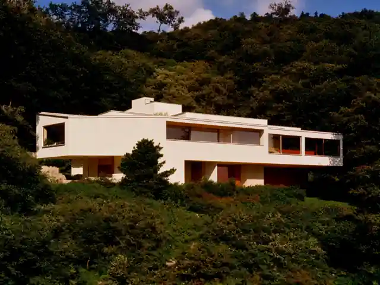

- 适用题材：复古文艺、经典电影感、怀旧叙事。
- 可见元素：经典胶片质感、柔和高光滚降、有机色彩、考究布光、电影感纵深。
- prompt 写法：`复古电影摄影风格，经典胶片质感，柔和高光滚降，有机色彩，考究布光，电影感纵深`。

#### 美式复古怪异影视风格

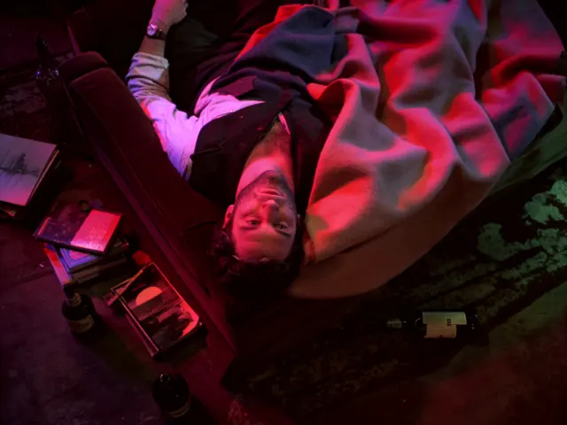

- 适用题材：美式怪诞、复古悬疑、超现实怪谈。
- 可见元素：复古美式陈设、诡异饱和配色、不安构图、戏剧硬光、怪异疏离感。
- prompt 写法：`美式复古怪异影视风格，复古美式陈设，诡异饱和配色，不安构图，戏剧硬光，怪异疏离感`。

#### 荒诞高调白色色调电影风格

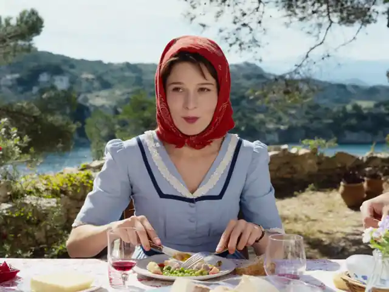

- 适用题材：荒诞喜剧、超现实白色空间、梦境/实验影像。
- 可见元素：高调过曝白、极低对比、大面积留白、柔和无影布光、疏离荒诞感。
- prompt 写法：`荒诞高调白色色调电影风格，高调过曝白，极低对比，大面积留白，柔和无影布光，疏离荒诞感，真人实景`。

#### 蓝橙色调影视风格

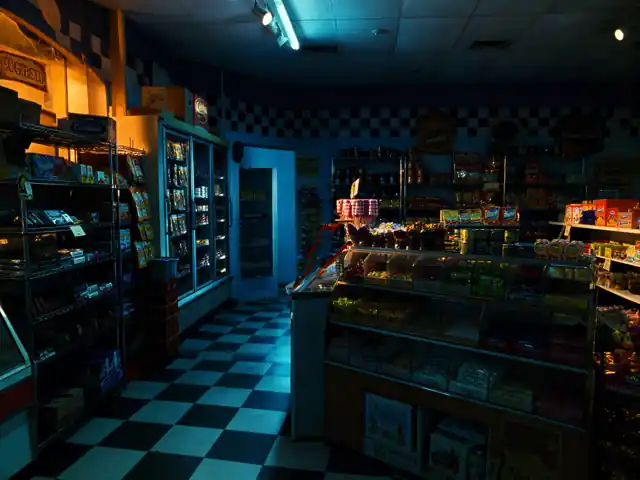

- 适用题材：好莱坞商业大片、动作/科幻、强对比视觉。
- 可见元素：蓝橙互补高对比、肤色暖橙、暗部冷青、强戏剧布光、电影通透质感。
- prompt 写法：`蓝橙色调影视风格，蓝橙互补高对比，肤色暖橙，暗部冷青，强戏剧布光，电影通透质感，真人实景`。

#### 工业电影风格

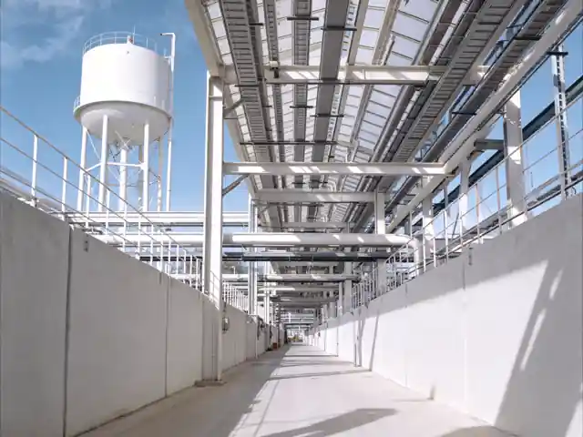

- 适用题材：现代工业、机械重工、硬核科技纪实。
- 可见元素：冷硬金属质感、厂区机械、冷蓝灰、硬光高光、精密机械细节。
- prompt 写法：`工业电影风格，冷硬金属质感，厂区机械，冷蓝灰，硬光高光，精密机械细节，真人实景`。

#### 美式经济上行风格

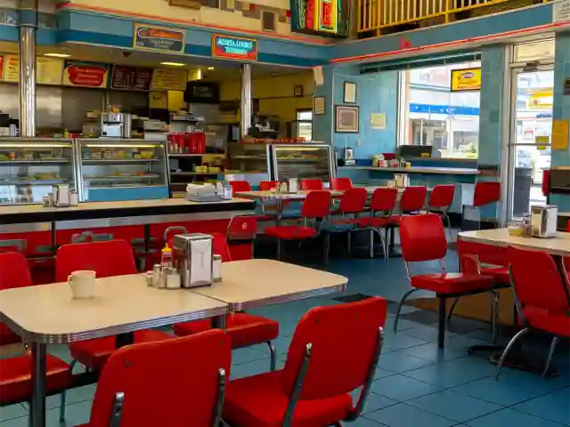

- 适用题材：美式繁荣年代、复古都市、消费时代叙事。
- 可见元素：明亮乐观暖调、繁华都市、复古时尚妆造、饱满布光、上行繁荣气质。
- prompt 写法：`美式经济上行风格，明亮乐观暖调，繁华都市，复古时尚妆造，饱满布光，繁荣气质，真人实景`。

#### 90 年代港片风格

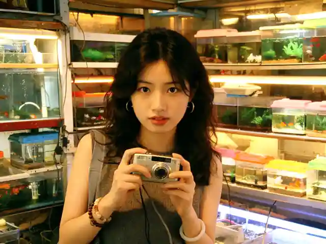

- 适用题材：港式怀旧、90 年代香港、市井江湖。
- 可见元素：霓虹与暖钨光、潮湿市井街景、高饱和复古、胶片颗粒、港味烟火气。
- prompt 写法：`90 年代港片风格，霓虹与暖钨光，潮湿市井街景，高饱和复古，胶片颗粒，港味烟火气`。

#### 科技感电影风格

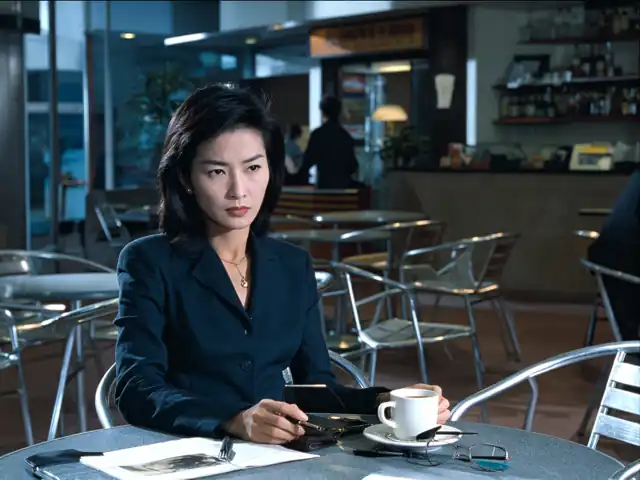

- 适用题材：现代科技、未来都市、智能产品叙事。
- 可见元素：冷蓝高光泽、通透洁净、精密界面与材质、硬朗布光、未来科技质感。
- prompt 写法：`科技感电影风格，冷蓝高光泽，通透洁净，精密界面与材质，硬朗布光，未来科技质感，真人实景`。

#### 悬疑电影风格

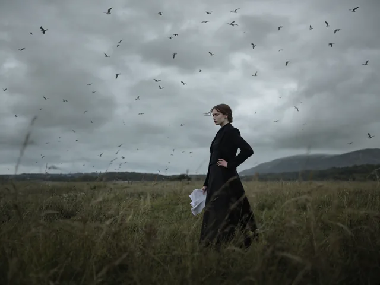

- 适用题材：悬疑推理、心理惊悚、犯罪叙事。
- 可见元素：低调暗部、冷调克制、阴影分割、局部硬光、紧张未知氛围。
- prompt 写法：`悬疑电影风格，低调暗部，冷调克制，阴影分割，局部硬光，紧张未知氛围，真人实景`。

#### 希腊神话电影风格

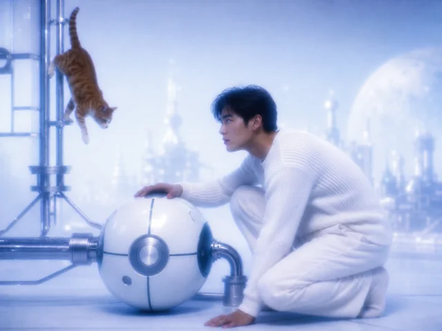

- 适用题材：古希腊史诗、神话历史、古典传奇。
- 可见元素：大理石与金光、古典布景、暖金高光、史诗纵深、庄严神性质感。
- prompt 写法：`希腊神话电影风格，大理石与金光，古典布景，暖金高光，史诗纵深，庄严神性质感，真人实景`。

#### 美式复古影视风格

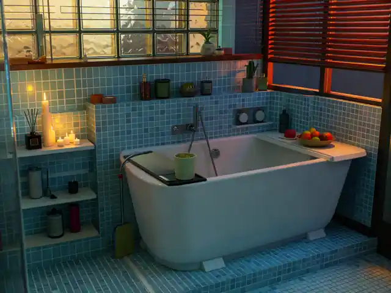

- 适用题材：美式年代戏、复古生活、怀旧叙事。
- 可见元素：复古暖调、美式陈设、柔和胶片质感、考究布光、怀旧生活感。
- prompt 写法：`美式复古影视风格，复古暖调，美式陈设，柔和胶片质感，考究布光，怀旧生活感，真人实景`。

#### 好莱坞黑白电影风格

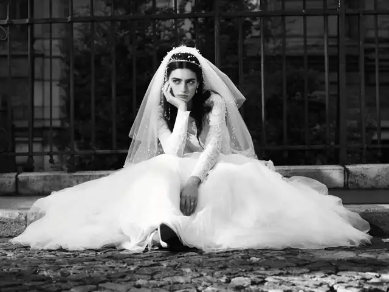

- 适用题材：黄金时代黑白片、经典好莱坞、古典戏剧。
- 可见元素：黑白高光泽、戏剧性硬光与阴影、丰富灰阶、经典构图、古典华丽感。
- prompt 写法：`好莱坞黑白电影风格，黑白高光泽，戏剧性硬光与阴影，丰富灰阶，经典构图，古典华丽感`。

#### 紫色色调电影风格


- 适用题材：梦幻迷离、情欲暧昧、夜色霓虹叙事。
- 可见元素：紫调统一、品红与冷紫渐变、暗部偏紫、迷离柔光、梦幻暧昧氛围。
- prompt 写法：`紫色色调电影风格，紫调统一，品红与冷紫渐变，暗部偏紫，迷离柔光，梦幻暧昧氛围，真人实景`。

### 二、2D 插画与动画类（29，官方「2D」tab）

二维手绘、插画、漫画与水墨流派。质感方向是「平面绘画、线条与笔触、二维上色」，无三维体积。

#### 二次元概念艺术风格

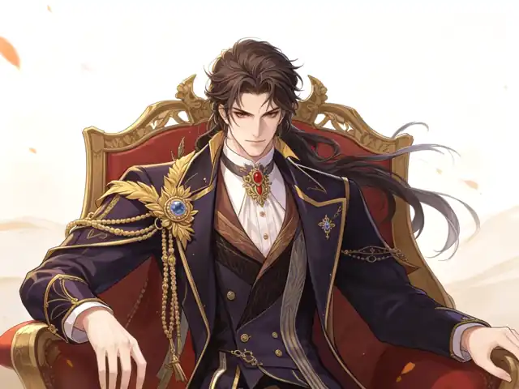

- 适用题材：二次元设定原画、动画概念、角色立绘。
- 可见元素：精细二次元造型、概念美术构图、丰富细节、氛围光、绘画质感。
- prompt 写法：`二次元概念艺术风格，精细二次元造型，概念美术构图，丰富细节，氛围光，绘画质感`。

#### 美国游戏概念艺术风格


- 适用题材：欧美游戏原画、场景概念、设定美术。
- 可见元素：欧美写实插画、宏大场景概念、厚涂质感、戏剧氛围光、绘画构成。
- prompt 写法：`美国游戏概念艺术风格，欧美写实插画，宏大场景概念，厚涂质感，戏剧氛围光，绘画构成`。

#### 日系平涂插画风格

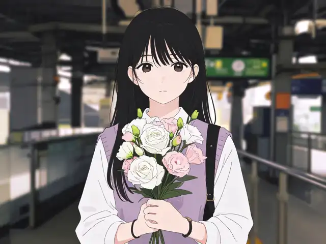

- 适用题材：日系平涂插画、清新海报、扁平动画。
- 可见元素：扁平平涂上色、干净线条、清新配色、简洁阴影、二维平面感。
- prompt 写法：`日系平涂插画风格，扁平平涂上色，干净线条，清新配色，简洁阴影，二维平面感`。

#### 插画蒸汽波风格

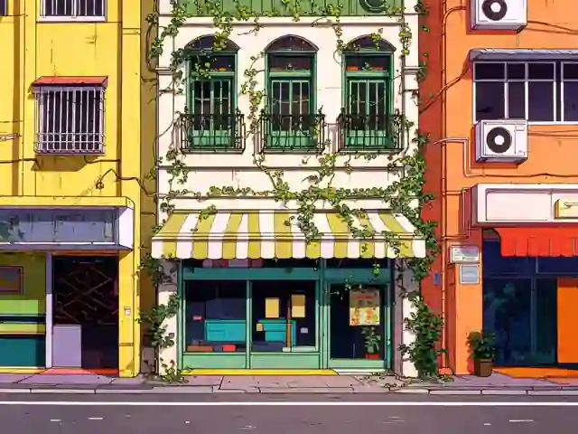

- 适用题材：蒸汽波视觉、复古未来插画、氛围 MV。
- 可见元素：粉青紫粉彩、几何网格、复古元素、低多边形/扫描线、梦幻迟缓氛围。
- prompt 写法：`插画蒸汽波风格，粉青紫粉彩双色调，几何网格地平线，复古元素，扫描线辉光，梦幻氛围`。

#### 赛博朋克数字插画风格

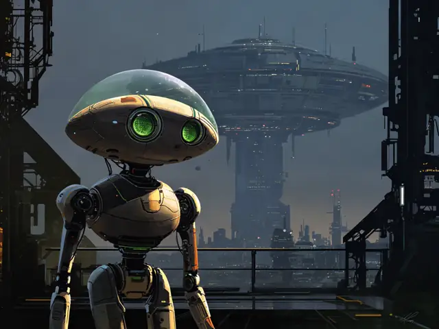

- 适用题材：赛博朋克插画、科幻概念、霓虹都市原画。
- 可见元素：霓虹光效、雨夜反光、青品红强对比、数字厚涂、科幻氛围。
- prompt 写法：`赛博朋克数字插画风格，霓虹光效，雨夜反光，青品红强对比，数字厚涂，科幻氛围`。

#### 游戏概念艺术风格


- 适用题材：通用游戏原画、场景/角色概念、设定美术。
- 可见元素：概念美术构图、厚涂质感、氛围光影、丰富细节、绘画构成。
- prompt 写法：`游戏概念艺术风格，概念美术构图，厚涂质感，氛围光影，丰富细节，绘画构成`。

#### 国漫二次元常用风格


- 适用题材：国漫动画、二次元剧集、国产番。
- 可见元素：国漫造型、清晰线条、赛璐珞上色、明亮配色、二次元质感。
- prompt 写法：`国漫二次元常用风格，国漫造型，清晰线条，赛璐珞上色，明亮配色，二次元质感`。

#### 达利风格

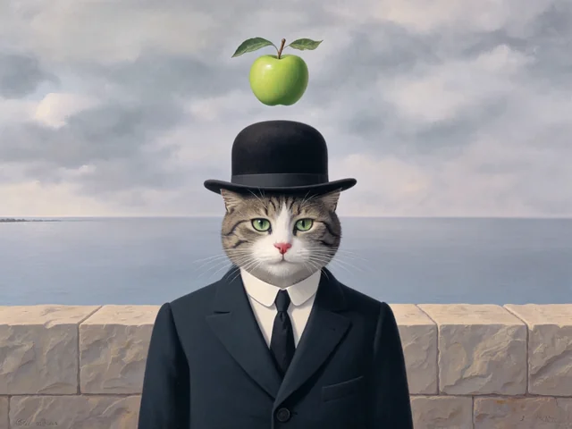

- 适用题材：超现实主义、艺术概念、梦境插画。
- 可见元素：超现实意象、扭曲变形、荒诞构成、油画质感、梦境氛围。
- prompt 写法：`达利风格，超现实意象，扭曲变形，荒诞构成，油画质感，梦境氛围`。

#### 黑白水墨风格

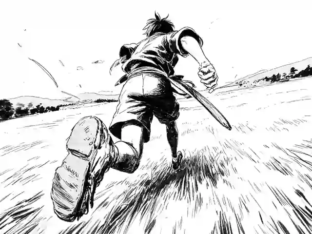

- 适用题材：水墨意境、东方禅意、写意短片。
- 可见元素：黑白水墨、墨色浓淡晕染、留白、毛笔笔触、写意东方质感。
- prompt 写法：`黑白水墨风格，墨色浓淡晕染，大量留白，毛笔笔触，写意东方质感`。

#### 美国漫画动画插画风格

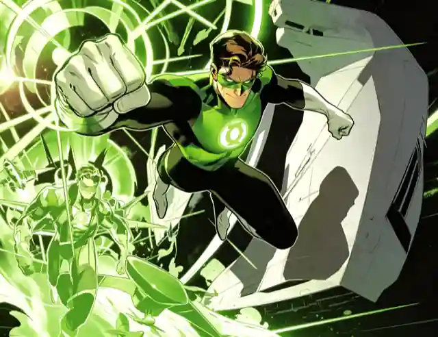

- 适用题材：美漫风格、英雄漫画、美式动画插画。
- 可见元素：粗黑描边、网点与平涂、高饱和配色、夸张动势、美漫质感。
- prompt 写法：`美国漫画动画插画风格，粗黑描边，网点与平涂，高饱和配色，夸张动势，美漫质感`。

#### 复古肌理迷幻插画风格


- 适用题材：迷幻复古海报、70 年代视觉、艺术 MV。
- 可见元素：复古肌理、迷幻配色、流动有机图形、做旧质感、致幻氛围。
- prompt 写法：`复古肌理迷幻插画风格，复古肌理，迷幻配色，流动有机图形，做旧质感，致幻氛围`。

#### 儿童蜡笔手绘插画风

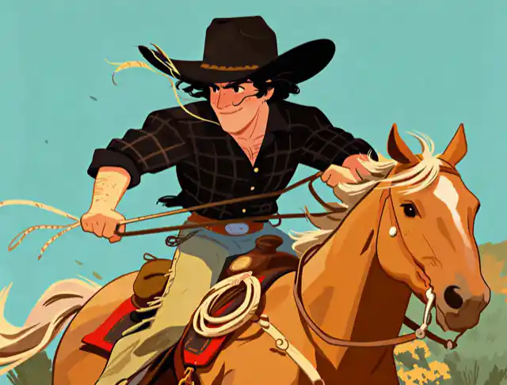

- 适用题材：儿童绘本、童趣短片、手绘治愈。
- 可见元素：蜡笔笔触、稚拙线条、明亮糖果色、纸面纹理、童真手绘感。
- prompt 写法：`儿童蜡笔手绘插画风，蜡笔笔触，稚拙线条，明亮糖果色，纸面纹理，童真手绘感`。

#### 黑白二维漫画动画风格

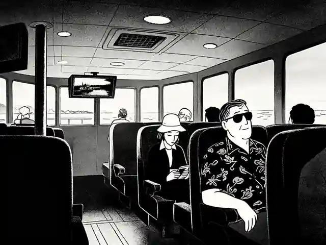

- 适用题材：黑白漫画、单行本风、线稿动画。
- 可见元素：黑白线稿、网点阴影、清晰描边、高对比、漫画分镜质感。
- prompt 写法：`黑白二维漫画动画风格，黑白线稿，网点阴影，清晰描边，高对比，漫画分镜质感`。

#### 高质量 2D 热血漫风格

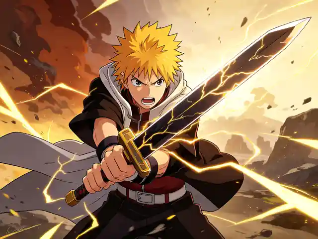

- 适用题材：少年热血番、动作漫画、燃系动画。
- 可见元素：动感线条与速度线、夸张动势、鲜明饱和、强烈光影、热血张力。
- prompt 写法：`高质量 2D 热血漫风格，动感速度线，夸张动势，鲜明饱和，强烈光影，热血张力`。

#### 大友克洋风格

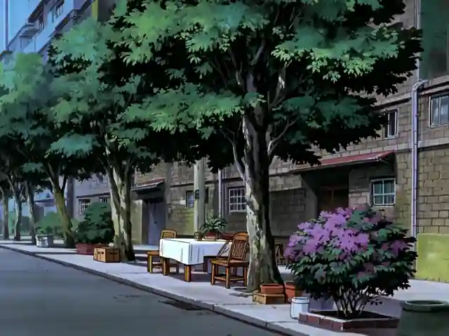

- 适用题材：硬核科幻动画、赛博废土、《阿基拉》式叙事。
- 可见元素：精密机械与都市、写实硬核线条、冷硬配色、宏大场面、80 年代科幻质感。
- prompt 写法：`大友克洋风格，精密机械与都市，写实硬核线条，冷硬配色，宏大场面，复古科幻质感`。

#### 暗色调厚涂风格插画

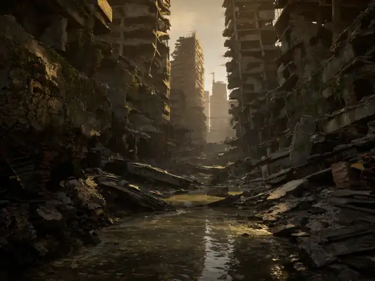

- 适用题材：暗黑厚涂、奇幻概念、阴郁艺术插画。
- 可见元素：浓郁厚涂笔触、暗调低饱和、戏剧光影、油画质感、阴郁氛围。
- prompt 写法：`暗色调厚涂风格插画，浓郁厚涂笔触，暗调低饱和，戏剧光影，油画质感，阴郁氛围`。

#### 手冢治虫时代卡通画风


- 适用题材：复古日漫、昭和动画、经典卡通。
- 可见元素：圆润复古造型、简洁线条、复古配色、经典赛璐珞、怀旧卡通质感。
- prompt 写法：`手冢治虫时代卡通画风，圆润复古造型，简洁线条，复古配色，经典赛璐珞，怀旧卡通质感`。

#### 上美画风

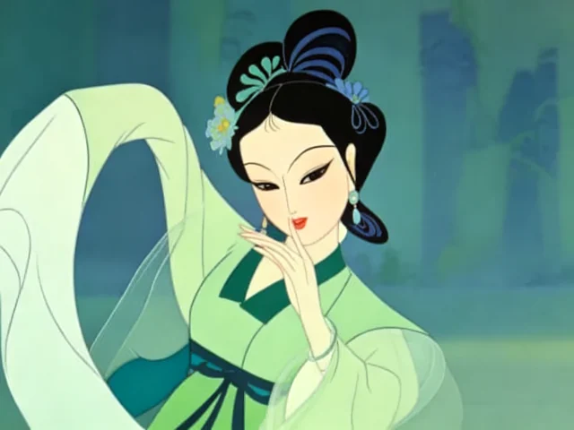

- 适用题材：上海美术电影厂风、民族动画、传统工艺动画。
- 可见元素：中国传统美术、装饰性造型、民族配色、工笔/水墨/剪纸质感、民族动画韵味。
- prompt 写法：`上美画风，中国传统美术，装饰性造型，民族配色，工笔与水墨质感，民族动画韵味`。

#### 中国神话风格

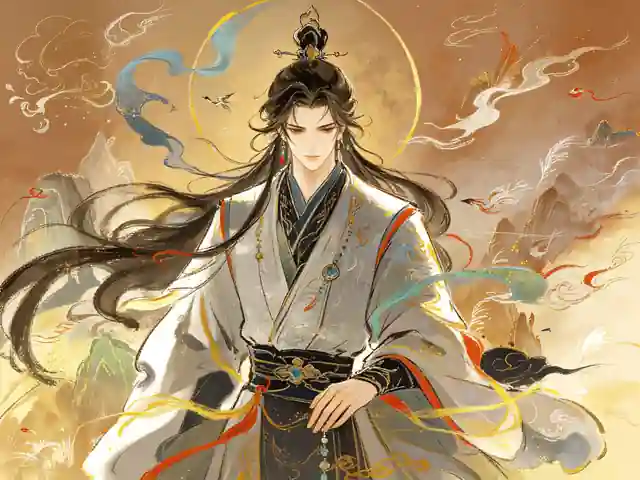

- 适用题材：中式神话史诗、仙侠传奇、上古神话。
- 可见元素：东方神话意象、祥云山海、金红主调、神性光晕、磅礴史诗质感。
- prompt 写法：`中国神话风格，东方神话意象，祥云山海，金红主调，神性光晕，磅礴史诗质感`。

#### 二维卡通插画风格

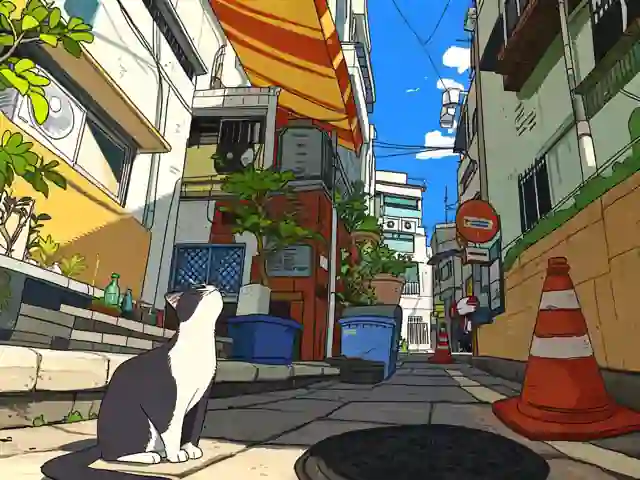

- 适用题材：通用二维卡通、扁平插画、亲和向动画。
- 可见元素：卡通造型、清晰线条、平涂上色、明亮配色、二维平面感。
- prompt 写法：`二维卡通插画风格，卡通造型，清晰线条，平涂上色，明亮配色，二维平面感`。

#### 黑暗原画概念风格

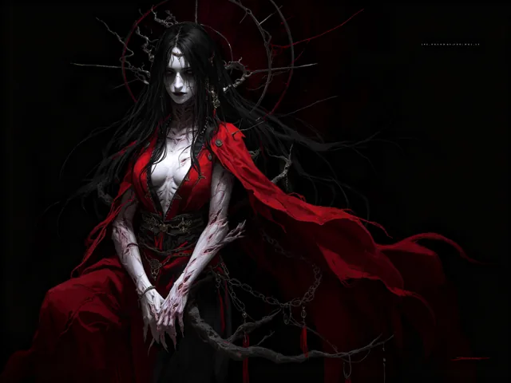

- 适用题材：黑暗系游戏原画、暗黑奇幻概念、Boss 设定。
- 可见元素：暗调厚涂、压抑配色、戏剧光影、宏大暗黑场景、阴郁概念美术。
- prompt 写法：`黑暗原画概念风格，暗调厚涂，压抑配色，戏剧光影，宏大暗黑场景，阴郁概念美术`。

#### 皮影戏插画风格

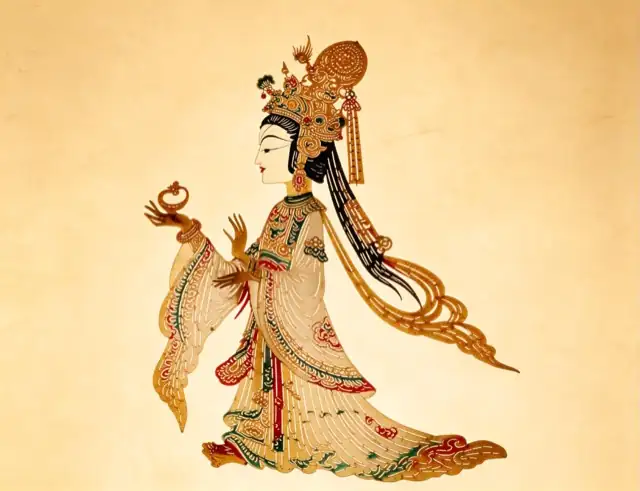

- 适用题材：皮影艺术、传统民俗、剪影叙事。
- 可见元素：剪影造型、镂空纹样、暖黄透光、平面剪纸质感、传统民俗韵味。
- prompt 写法：`皮影戏插画风格，剪影造型，镂空纹样，暖黄透光，平面剪纸质感，传统民俗韵味`。

#### 美式黑暗插画风格

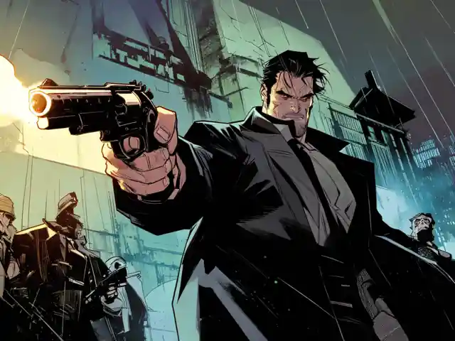

- 适用题材：美式暗黑插画、惊悚概念、哥特叙事。
- 可见元素：暗调厚涂、阴郁配色、戏剧硬光、扭曲造型、美式暗黑质感。
- prompt 写法：`美式黑暗插画风格，暗调厚涂，阴郁配色，戏剧硬光，扭曲造型，美式暗黑质感`。

#### 黑暗奇幻插画风格

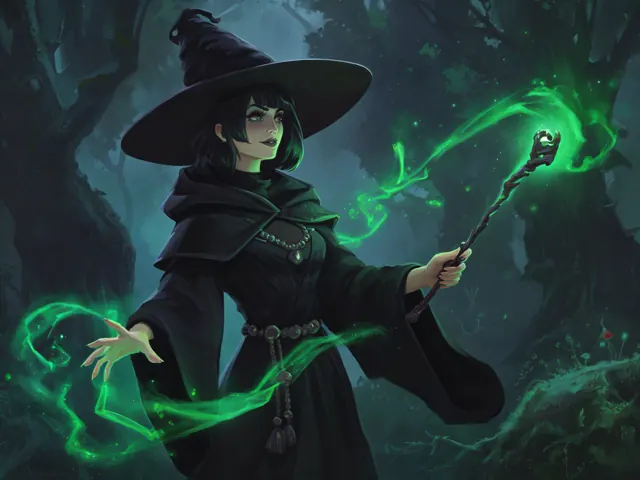

- 适用题材：黑暗奇幻、暗黑魔幻、阴郁史诗插画。
- 可见元素：暗黑奇幻意象、低饱和暗调、戏剧光影、厚涂质感、宏大阴郁氛围。
- prompt 写法：`黑暗奇幻插画风格，暗黑奇幻意象，低饱和暗调，戏剧光影，厚涂质感，宏大阴郁氛围`。

#### 暗黑漫画风格

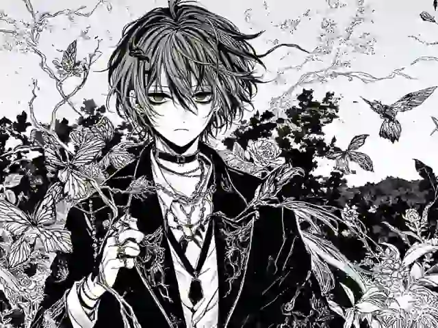

- 适用题材：暗黑系漫画、惊悚剧情、阴郁线稿叙事。
- 可见元素：高对比黑白、浓重阴影、锐利线条、网点质感、压抑暗黑氛围。
- prompt 写法：`暗黑漫画风格，高对比黑白，浓重阴影，锐利线条，网点质感，压抑暗黑氛围`。

#### 简洁插画风格

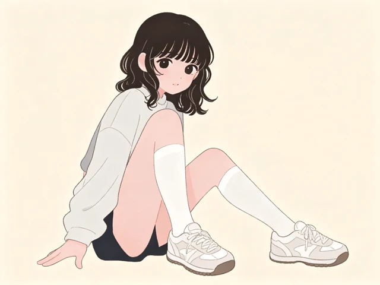

- 适用题材：极简插画、扁平海报、清爽视觉。
- 可见元素：极简造型、大面积留白、干净线条、清爽配色、平面设计感。
- prompt 写法：`简洁插画风格，极简造型，大面积留白，干净线条，清爽配色，平面设计感`。

#### 复古半色调暗色调哥特风格


- 适用题材：哥特复古、暗黑印刷感、复古恐怖插画。
- 可见元素：半色调网点、暗调哥特配色、做旧印刷质感、阴郁造型、复古恐怖氛围。
- prompt 写法：`复古半色调暗色调哥特风格，半色调网点，暗调哥特配色，做旧印刷质感，阴郁造型，复古恐怖氛围`。

#### 东方水墨画风

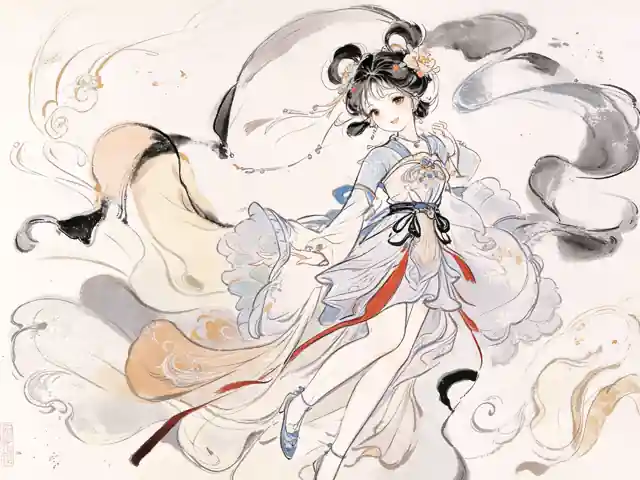

- 适用题材：东方水墨、写意国风、禅意短片。
- 可见元素：水墨晕染、留白意境、淡彩点染、毛笔笔触、写意东方韵味。
- prompt 写法：`东方水墨画风，水墨晕染，留白意境，淡彩点染，毛笔笔触，写意东方韵味`。

#### 像素风


- 适用题材：像素游戏、复古 8-bit、怀旧像素动画。
- 可见元素：方块像素、有限色板、点阵抖动、复古游戏质感、像素动画。
- prompt 写法：`像素风，方块像素，有限色板，点阵抖动，复古游戏质感，像素动画`。

### 三、3D 与 CGI 类（30，官方「3D」tab）

三维渲染质感的卡通、写实与工艺流派。质感方向是「三维体积、材质渲染、立体光影」，与真人实拍互斥。

#### 高品质动画渲染风格


- 适用题材：高规格 3D 动画长片、皮克斯式叙事、精品动画。
- 可见元素：精细次表面散射、柔和体积光、细腻材质、电影级 3D 渲染、高完成度。
- prompt 写法：`高品质动画渲染风格，精细次表面散射，柔和体积光，细腻材质，电影级 3D 渲染`。

#### 3D 风格化渲染

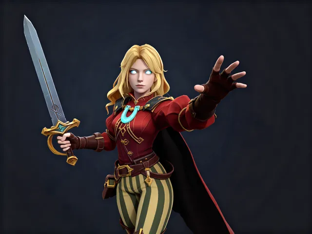

- 适用题材：风格化 3D 短片、概念动画、艺术化三维。
- 可见元素：夸张比例与造型、风格化材质、艺术化布光、鲜明色彩、三维体积。
- prompt 写法：`3D 风格化渲染，夸张比例造型，风格化材质，艺术化布光，鲜明色彩，三维体积`。

#### 3D 卡通微缩景观

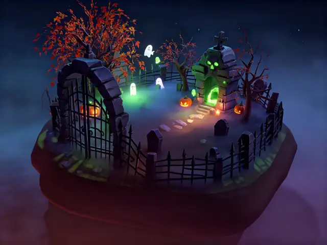

- 适用题材：微缩世界、移轴小景、可爱场景动画。
- 可见元素：微缩模型质感、移轴浅景深、可爱卡通造型、柔和布光、精致小场景。
- prompt 写法：`3D 卡通微缩景观，微缩模型质感，移轴浅景深，可爱卡通造型，柔和布光，精致小场景`。

#### 3D 西方卡通风格的绘制

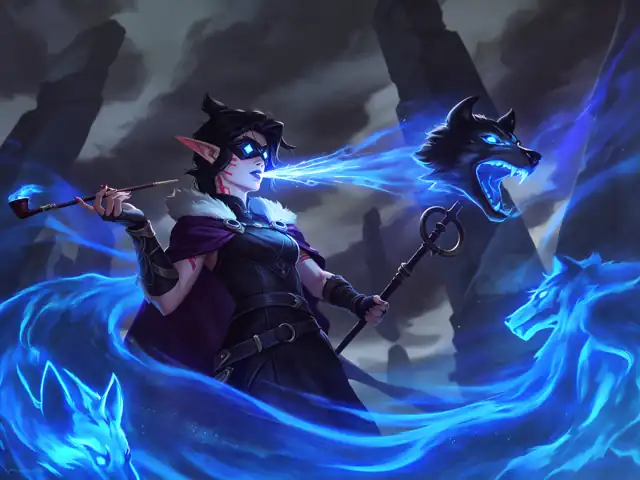

- 适用题材：欧美卡通动画、手绘感 3D、绘本式动画。
- 可见元素：手绘笔触叠加 3D 体积、欧美卡通造型、暖明配色、绘制质感。
- prompt 写法：`3D 西方卡通绘制风格，手绘笔触叠加三维体积，欧美卡通造型，暖明配色，绘制质感`。

#### 欧美风格化 3D 渲染

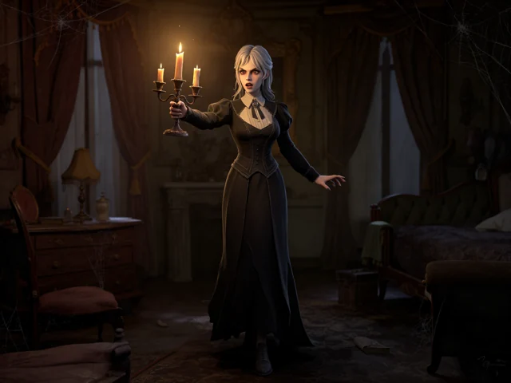

- 适用题材：欧美风格化动画、概念三维、艺术短片。
- 可见元素：欧美审美造型、风格化材质与配色、戏剧布光、夸张张力、三维体积。
- prompt 写法：`欧美风格化 3D 渲染，欧美审美造型，风格化材质配色，戏剧布光，夸张张力，三维体积`。

#### 3D 数字雕刻风格

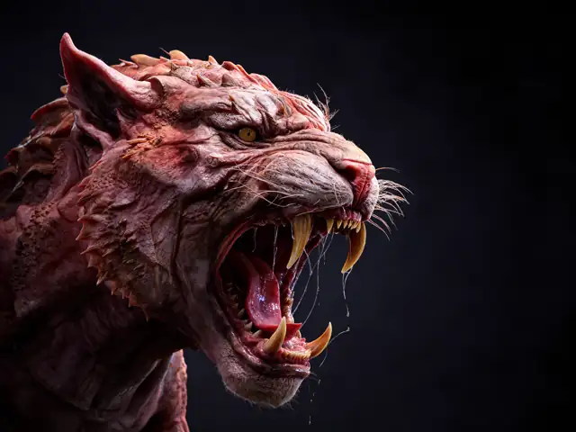

- 适用题材：数字雕塑、概念角色、高模展示。
- 可见元素：高模雕刻细节、清晰结构面、棚拍布光、材质纹理、雕塑体量感。
- prompt 写法：`3D 数字雕刻风格，高模雕刻细节，清晰结构面，棚拍布光，材质纹理，雕塑体量感`。

#### 3D 国风高清渲染风格

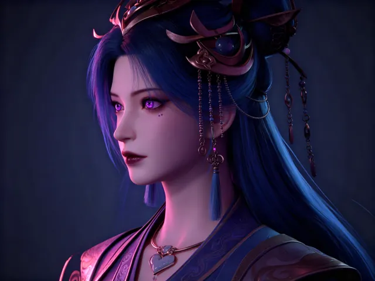

- 适用题材：国风 3D 动画、东方奇幻、古风三维。
- 可见元素：东方造型与服饰、精细高清材质、柔和体积光、国风配色、三维体积。
- prompt 写法：`3D 国风高清渲染风格，东方造型与服饰，精细高清材质，柔和体积光，国风配色，三维体积`。

#### 3D 美式卡通游戏美术

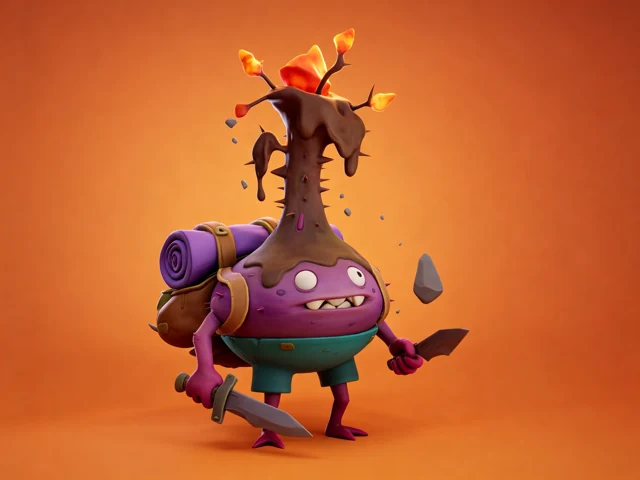

- 适用题材：美式卡通游戏、Q 版角色、游戏 CG。
- 可见元素：美式卡通造型、鲜明饱和配色、游戏美术质感、清晰描边、三维体积。
- prompt 写法：`3D 美式卡通游戏美术，美式卡通造型，鲜明饱和配色，游戏美术质感，清晰描边，三维体积`。

#### 3D 盲盒涂装风

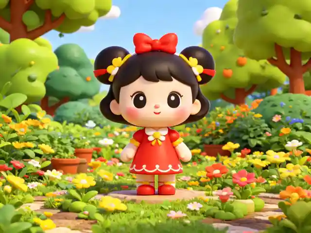

- 适用题材：盲盒手办、潮玩展示、可爱 IP。
- 可见元素：手办涂装质感、圆润可爱造型、磨砂塑料材质、柔和棚光、潮玩精致感。
- prompt 写法：`3D 盲盒涂装风，手办涂装质感，圆润可爱造型，磨砂塑料材质，柔和棚光，潮玩精致感`。

#### 动漫三渲二风格

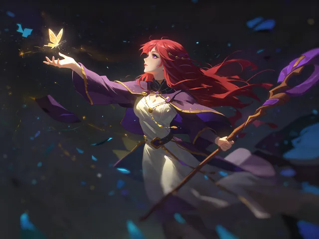

- 适用题材：三渲二动画、国漫/日漫动画、卡通赛璐珞。
- 可见元素：3D 建模 + 2D 赛璐珞上色、清晰描边、平面化阴影、动画质感、二次元造型。
- prompt 写法：`动漫三渲二风格，三维建模配二维赛璐珞上色，清晰描边，平面化阴影，二次元造型`。

#### 超现实 3D 渲染风格

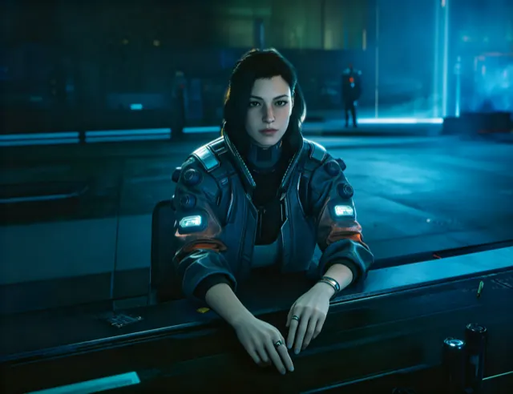

- 适用题材：超现实概念、艺术装置、梦境三维。
- 可见元素：超现实构成、非常规材质与光、梦幻配色、漂浮元素、三维体积。
- prompt 写法：`超现实 3D 渲染风格，超现实构成，非常规材质与光，梦幻配色，漂浮元素，三维体积`。

#### UE5 写实渲染

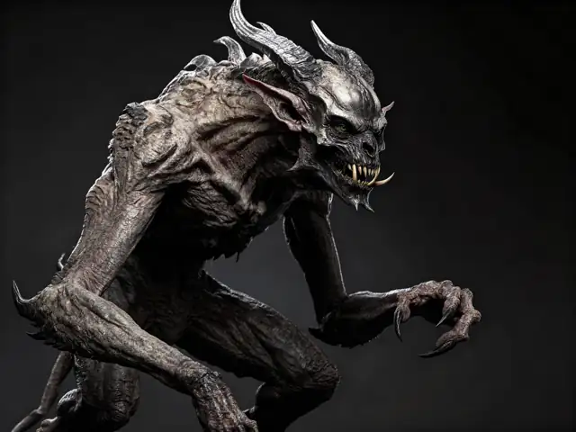

- 适用题材：虚幻引擎写实、游戏过场、实时渲染大场景。
- 可见元素：UE5 实时光追、写实材质、Lumen 全局光、Nanite 细节、电影级三维。
- prompt 写法：`UE5 写实渲染，实时光追，写实材质，全局光照，高密度细节，电影级三维`。

#### 国风 3D 高清渲染风格

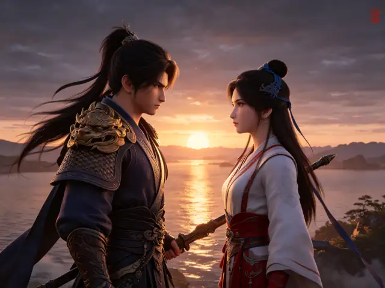

- 适用题材：国风三维大片、东方奇幻、古风游戏 CG。
- 可见元素：东方建筑与服饰、高清精细材质、磅礴体积光、国风配色、三维纵深。
- prompt 写法：`国风 3D 高清渲染风格，东方建筑与服饰，高清精细材质，磅礴体积光，国风配色，三维纵深`。

#### 3D 卡通渲染风格


- 适用题材：通用 3D 卡通、儿童动画、亲和向叙事。
- 可见元素：圆润卡通造型、柔和材质、明亮配色、柔光布光、三维体积。
- prompt 写法：`3D 卡通渲染风格，圆润卡通造型，柔和材质，明亮配色，柔光布光，三维体积`。

#### 美国卡通 3D 渲染风格

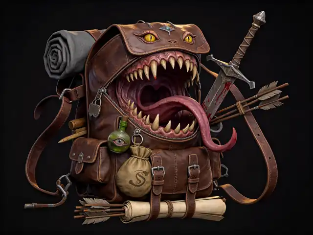

- 适用题材：美式 3D 卡通、合家欢动画、喜剧角色。
- 可见元素：美式夸张造型、弹性表情、鲜明配色、柔和布光、三维体积。
- prompt 写法：`美国卡通 3D 渲染风格，美式夸张造型，弹性表情，鲜明配色，柔和布光，三维体积`。

#### 3D 厚涂风格

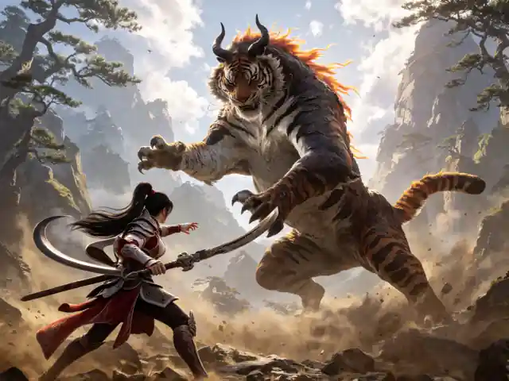

- 适用题材：厚涂质感三维、油画感动画、艺术化角色。
- 可见元素：厚涂笔触叠加三维、油画质感、浓郁配色、柔和布光、绘画体积。
- prompt 写法：`3D 厚涂风格，厚涂笔触叠加三维体积，油画质感，浓郁配色，柔和布光`。

#### 3D 真实感 PBR 渲染风格

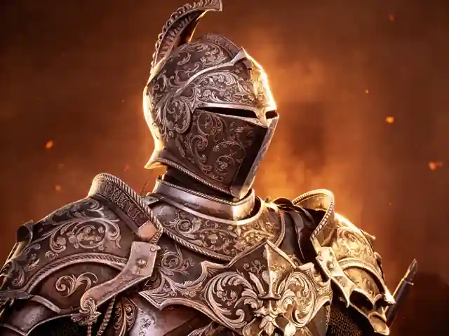

- 适用题材：写实产品、材质展示、真实感三维。
- 可见元素：PBR 物理材质、精准反射与粗糙度、写实布光、高保真细节、三维体量。
- prompt 写法：`3D 真实感 PBR 渲染风格，物理材质，精准反射与粗糙度，写实布光，高保真细节`。

#### 3D 游戏渲染风格

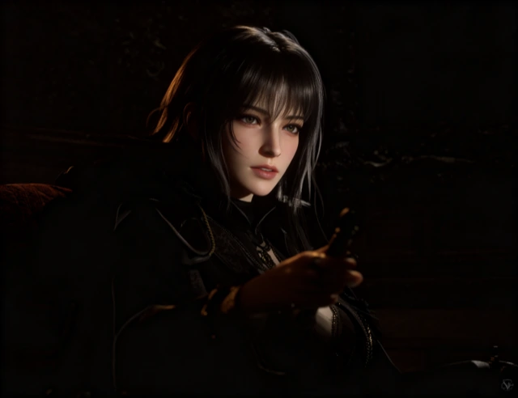

- 适用题材：游戏 CG、过场动画、实时游戏画面。
- 可见元素：游戏美术质感、风格化材质、戏剧布光、清晰角色造型、三维体积。
- prompt 写法：`3D 游戏渲染风格，游戏美术质感，风格化材质，戏剧布光，清晰角色造型，三维体积`。

#### 3D 人物（简约卡通风）


- 适用题材：极简卡通角色、扁平化 3D、亲和 IP。
- 可见元素：简约几何造型、扁平配色、干净材质、柔和布光、极简卡通体积。
- prompt 写法：`3D 人物简约卡通风，简约几何造型，扁平配色，干净材质，柔和布光，极简卡通体积`。

#### 3D 卡通动画风格

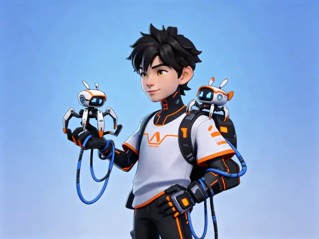

- 适用题材：3D 卡通连续动画、剧集动画、角色短片。
- 可见元素：卡通造型、流畅动画运动、明亮配色、柔和布光、三维体积。
- prompt 写法：`3D 卡通动画风格，卡通造型，流畅动画运动，明亮配色，柔和布光，三维体积`。

#### 复古 Y2K 奇幻风格

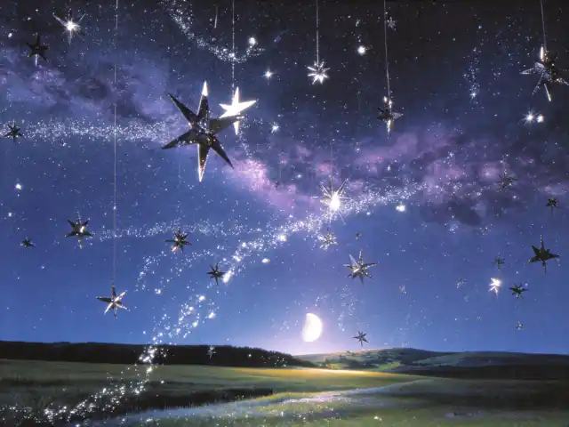

- 适用题材：千禧复古、Y2K 时尚、复古奇幻 MV。
- 可见元素：千禧金属感、亮粉电蓝荧光、复古数码质感、高光泽、梦幻奇幻氛围。
- prompt 写法：`复古 Y2K 奇幻风格，千禧金属感，亮粉电蓝荧光，复古数码质感，高光泽，梦幻奇幻氛围`。

#### 3D 魔幻角色扮演游戏

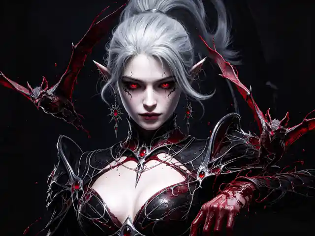

- 适用题材：奇幻 RPG、魔幻游戏 CG、史诗角色。
- 可见元素：奇幻装备与造型、魔幻材质与特效、戏剧布光、宏大场景、三维纵深。
- prompt 写法：`3D 魔幻角色扮演游戏风格，奇幻装备造型，魔幻材质与特效，戏剧布光，宏大场景，三维纵深`。

#### 粘土动画风格

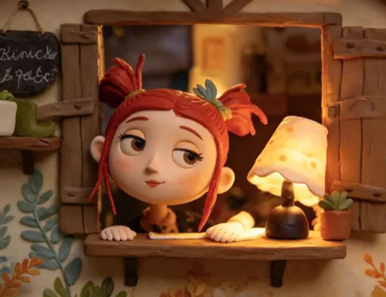

- 适用题材：定格粘土感动画、手作质感短片、童趣叙事。
- 可见元素：粘土捏塑质感、指纹与凹凸、哑光材质、柔和布光、手作温度感。
- prompt 写法：`粘土动画风格，粘土捏塑质感，指纹与凹凸，哑光材质，柔和布光，手作温度感`。

#### 3D 加强版卡通渲染风格


- 适用题材：高规格 3D 卡通、精品动画、电影级卡通。
- 可见元素：精细卡通造型、丰富次表面与材质、电影级布光、饱满配色、三维体积。
- prompt 写法：`3D 加强版卡通渲染风格，精细卡通造型，丰富次表面与材质，电影级布光，饱满配色`。

#### 3D 中国奇幻动画

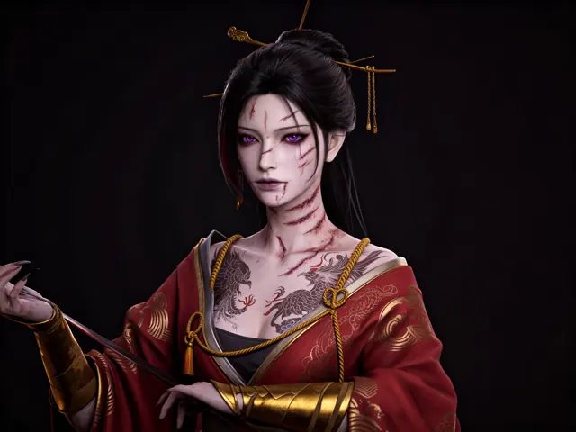

- 适用题材：国产 3D 奇幻动画、东方仙侠、神话三维。
- 可见元素：东方奇幻造型、仙侠特效、磅礴体积光、国风配色、三维纵深。
- prompt 写法：`3D 中国奇幻动画，东方奇幻造型，仙侠特效，磅礴体积光，国风配色，三维纵深`。

#### 3D 光泽乳胶渲染风格

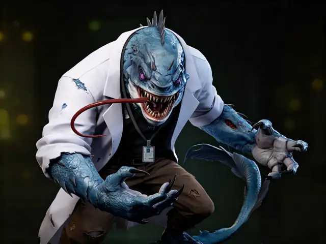

- 适用题材：高光泽潮玩、乳胶材质展示、时尚三维。
- 可见元素：乳胶高光泽材质、强反射高光、圆润造型、棚拍布光、时尚质感。
- prompt 写法：`3D 光泽乳胶渲染风格，乳胶高光泽材质，强反射高光，圆润造型，棚拍布光，时尚质感`。

#### 3D 果冻状塑料风格

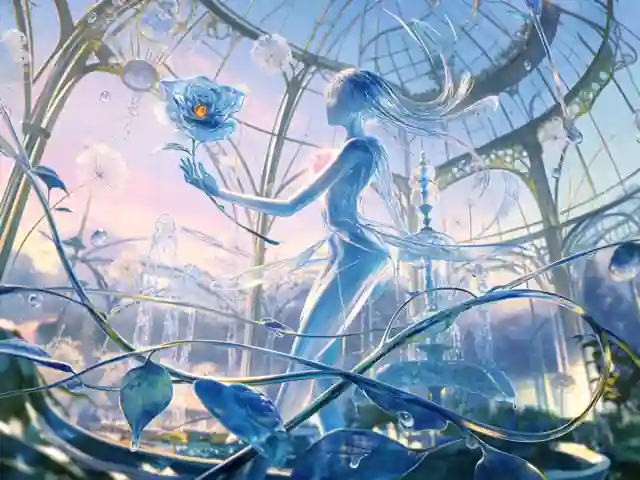

- 适用题材：果冻质感潮玩、Q 弹 IP、可爱三维。
- 可见元素：半透明果冻材质、次表面通透、圆润弹性造型、柔和布光、可爱质感。
- prompt 写法：`3D 果冻状塑料风格，半透明果冻材质，次表面通透，圆润弹性造型，柔和布光`。

#### 定格动画风格

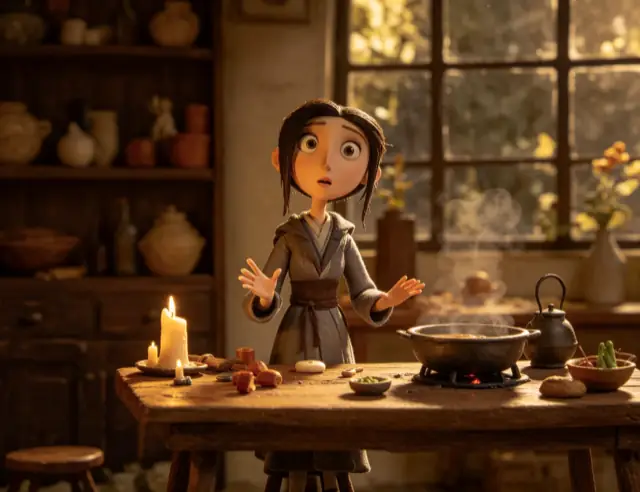

- 适用题材：定格偶动画、手作质感、复古童趣短片。
- 可见元素：实体偶/材料质感、逐帧定格运动、手作布景、柔和布光、复古手工感。
- prompt 写法：`定格动画风格，实体偶材料质感，逐帧定格运动，手作布景，柔和布光，复古手工感`。

#### 3D 西方卡通风格

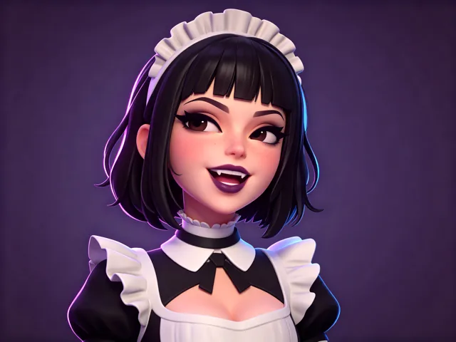

- 适用题材：欧美 3D 卡通、合家欢动画、喜剧角色。
- 可见元素：欧美卡通造型、夸张表情、明亮配色、柔和布光、三维体积。
- prompt 写法：`3D 西方卡通风格，欧美卡通造型，夸张表情，明亮配色，柔和布光，三维体积`。

#### 高清 3D 真实渲染风格


- 适用题材：高清写实三维、真实角色/产品、影视级渲染。
- 可见元素：高清写实材质、精细次表面、真实布光、高保真细节、三维体量。
- prompt 写法：`高清 3D 真实渲染风格，高清写实材质，精细次表面，真实布光，高保真细节`。
