# Visual Tone 视觉基调填法

> Load when: 要定整片视觉基调——填导演法【氛围与画质】的视觉基调子字段（这片子像用什么机器、什么画幅拍的，摄影机/镜头/画幅/胶片还是数字），整片不变的器材质感底色。
> Avoid: 要定是什么质感的世界、哪个题材流派（去 `style-core.md`）、随段落微调的色彩与影调（去 `lighting-tone.md`）、或景别构图运镜（去 `shot-scale.md` / `composition.md` / `camera-move.md`）。
> Pairs with: `../../../video-gen-director/references/director-method.md`【氛围与画质】定义有哪些子字段，本文件管视觉基调填什么；风格核心拆在 `style-core.md`、随段落微调的色彩与影调拆在 `lighting-tone.md`。视觉基调与风格核心一样整片基本不变，两层正交叠加。

视觉基调定「这片子像用什么机器、什么画幅拍的」——摄影机/镜头/画幅/胶片还是数字。它和风格核心（见 `style-core.md`）一样整片基本不变，决定画面的「物理质感底色」：风格核心定「世界长什么样」，视觉基调定「用什么器材拍的」，两层正交叠加。视觉基调可拆成四个正交子维度——**画幅取向、摄影机/拍摄格式、镜头光学性格、胶片还是数字质感**——下文按这四轴各列选项，每项按「适用场景 → 可见元素 → prompt 写法」给出成套翻译，从四轴各挑一项叠成一句，粘进【氛围与画质】的「视觉基调」槽；文末另给几组开箱即用的精选预设。

> 写法约定：Seedance 是中国模型，可仅用中文提示词。本文件正文与示例 prompt 一律中文，器材/格式专名作英文括注以便对齐业界共识（供外部图像/视频工具识别，非必需）。`media/visual-tone/` 下每项配同名 png 质感示意图供人工对照（按各项代表性画幅生成：画幅轴用各自真实比例，质感轴用最典型搭配画幅）。

> 调研采信：画幅与变形宽银幕参考 [StudioBinder 画幅指南](https://www.studiobinder.com/blog/aspect-ratio/)、[Wikipedia Anamorphic format](https://en.wikipedia.org/wiki/Anamorphic_format) / [IMAX](https://en.wikipedia.org/wiki/IMAX)；拍摄格式与机型参考 [Filmmakers Academy 胶片格式](https://www.filmmakersacademy.com/blog-super-8-16mm-film-35mm-film/)、[Wikipedia Super 35](https://en.wikipedia.org/wiki/Super_35)、[RED vs ARRI](https://www.videomaker.com/shooting/camera-equipment/red-vs-arri-who-makes-the-better-cinema-camera/)；镜头光学性格参考 [RED Anamorphic Lenses](https://www.red.com/red-101/anamorphic-lenses)、[Cooke Optics 球面vs变形](https://cookeoptics.com/news-and-events/spherical-vs-anamorphic-lenses/)；胶片vs数字质感参考 [Wikipedia Film emulation](https://en.wikipedia.org/wiki/Film_emulation)、[Analogue Wonderland Halation](https://analoguewonderland.co.uk/blogs/film-photography-blog/halation-on-film-the-enchanting-glow-of-analogue-photography)。

---

## 一、画幅取向（画幅 / 宽高比）

画幅决定画框形状——多宽多高、什么比例。它直接影响构图气派与情绪：越宽越史诗辽阔，越方越古典亲密，竖屏则贴合手机原生。整片锁定一个。

### 变形宽银幕 2.39:1（anamorphic scope）

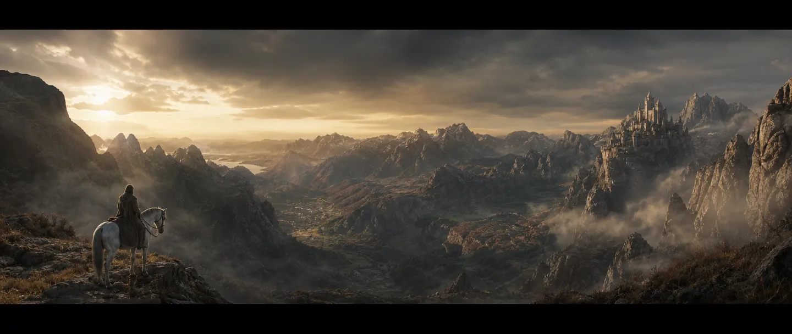

- 适用场景：史诗、科幻、大场面叙事，要"电影院大银幕"的横向气派。
- 可见元素：2.39:1 超宽画幅、上下黑边、宏大横向纵深、配变形镜头时有横向蓝色眩光与椭圆焦外。
- prompt 写法：`2.39:1 超宽银幕画幅anamorphic scope，宽幅电影构图，上下黑边letterbox，宏大横向纵深`。

### 平片宽幕 1.85:1（flat widescreen）

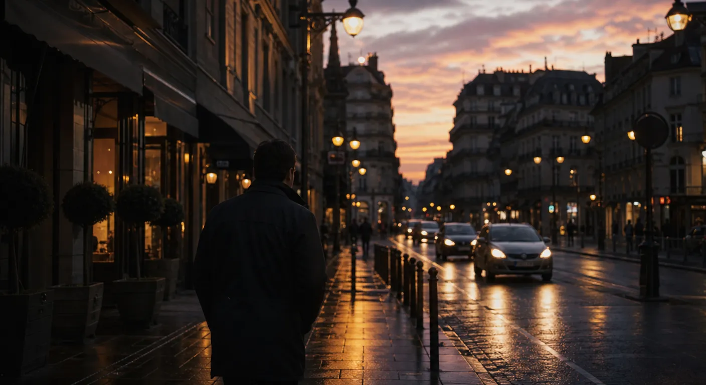

- 适用场景：剧情、喜剧、多数现代院线正片，要电影感但不必极宽。
- 可见元素：1.85:1 画幅、比 16:9 略宽、球面镜头的自然无变形透视、规整的院线"正片"观感。
- prompt 写法：`1.85:1 院线宽幕画幅flat widescreen，球面镜头自然透视，规整电影构图`。

### 学院画幅 1.37:1（Academy ratio）

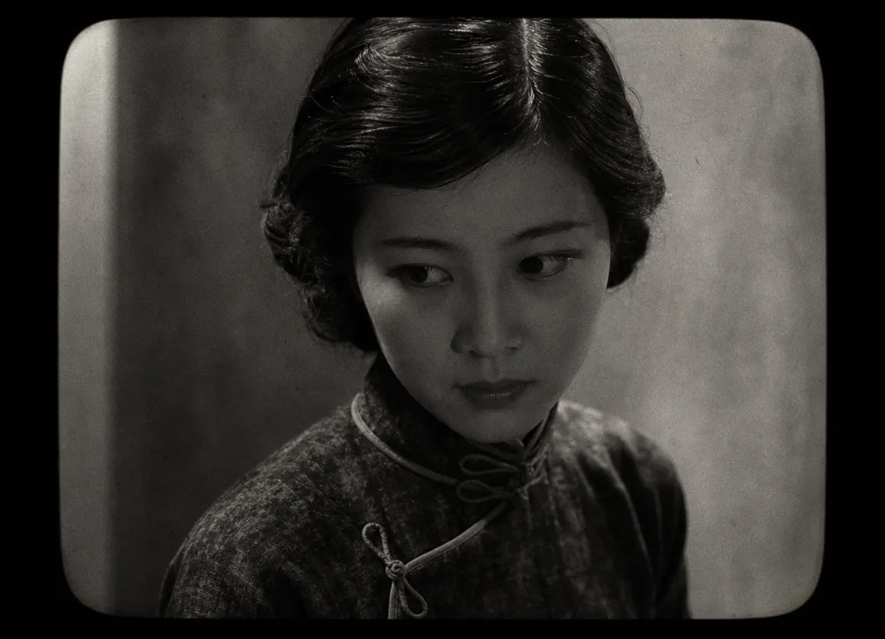

- 适用场景：年代戏、文艺片、刻意复古或亲密的"方盒子"质感（如《妈咪》《灯塔》）。
- 可见元素：接近方形的 1.37:1 画幅、左右收窄、人物在框内更显逼仄亲密、古典默片时代气息。
- prompt 写法：`1.37:1 学院画幅Academy ratio，接近方形的复古画框，左右收窄，亲密古典构图`。

### 标准宽屏 16:9 / 1.78:1（widescreen HD）

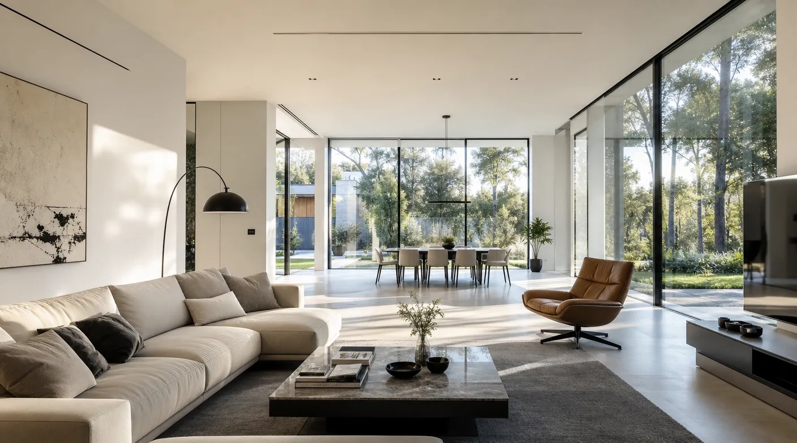

- 适用场景：现代写实、网剧、流媒体、商业广告，要当代电视/流媒体的通用观感。
- 可见元素：16:9 横画幅、当代数字内容的默认比例、无黑边、规整通透。
- prompt 写法：`16:9 标准宽屏画幅，当代流媒体比例，无黑边，规整现代构图`。

### IMAX 巨幕 1.43:1（IMAX large format）

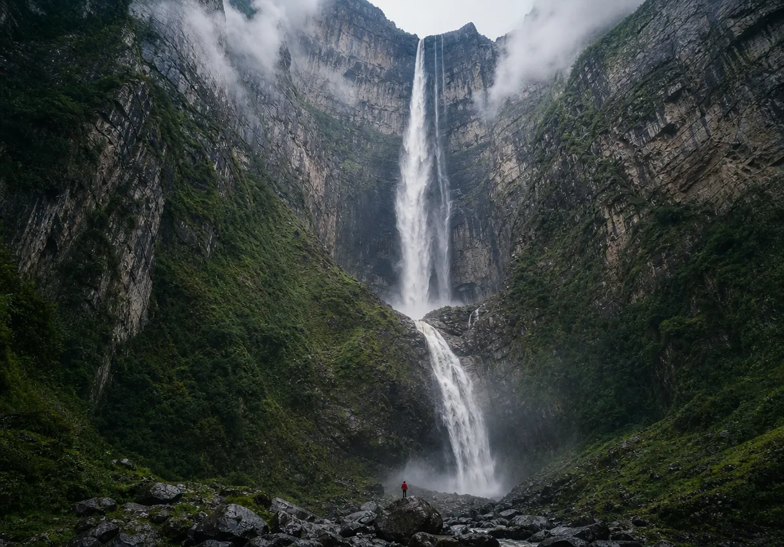

- 适用场景：要"顶天立地"的沉浸巨幕感——震撼风光、垂直高耸的奇观、史诗动作。
- 可见元素：接近方形的 1.43:1 高画幅、强调垂直规模与高度、超高清晰度、近无颗粒的临场沉浸。
- prompt 写法：`IMAX 巨幕画幅1.43:1，接近方形的高画幅，强调垂直规模，沉浸式超高清晰度`。

### 竖屏 9:16（vertical）

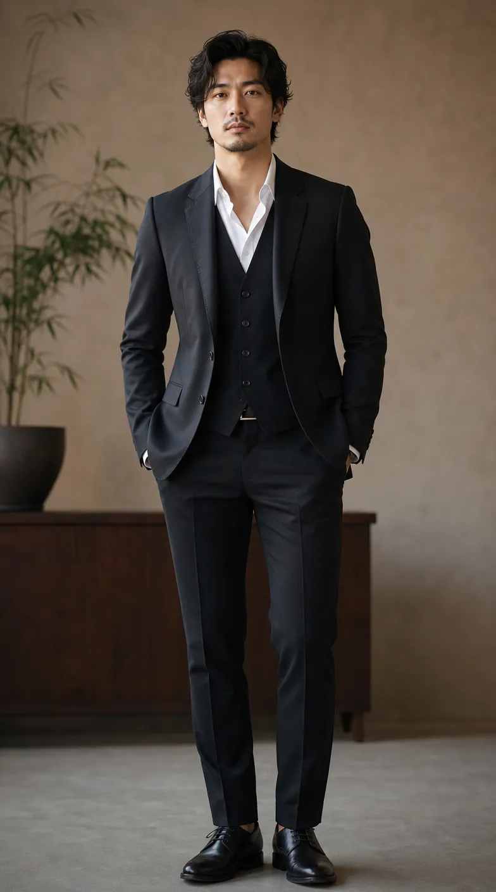

- 适用场景：竖屏短剧、社媒原生内容，要"为手机而拍"的原生竖画幅。
- 可见元素：9:16 竖画幅、人物纵向充满画面、贴合手机全屏、社媒原生观感。
- prompt 写法：`9:16 竖屏画幅，纵向构图，人物充满竖画面，手机全屏原生观感`。

---

## 二、摄影机 / 拍摄格式（介质规格 → 质感）

拍摄格式指用多大的底片或传感器拍——画幅格越大，颗粒越细、景深越浅、质感越"贵"。它是质感底色里最重的一笔，整片锁定一种。

### Super 8 / 8mm 胶片（Super 8）

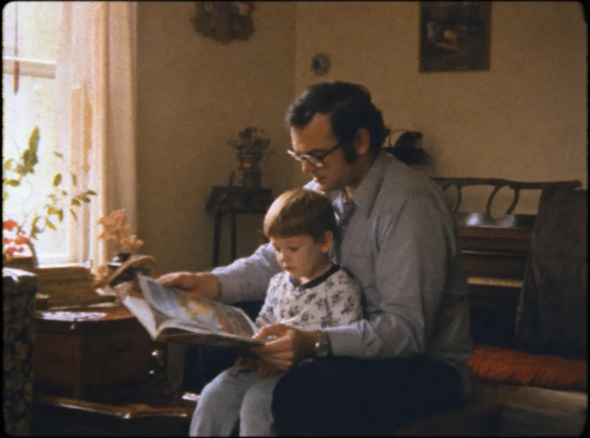

- 适用场景：回忆、闪回、家庭录像、梦境、私密 lo-fi 质感。
- 可见元素：粗重颗粒、柔软发虚、画面轻微抖动与跳格、暖旧偏色、4:3 倾向、强烈怀旧。
- prompt 写法：`Super 8 毫米胶片质感，粗重颗粒，柔软发虚，画面轻微抖动跳格，暖旧偏色，怀旧家庭录像感`。

### 16mm / Super 16 胶片（Super 16）

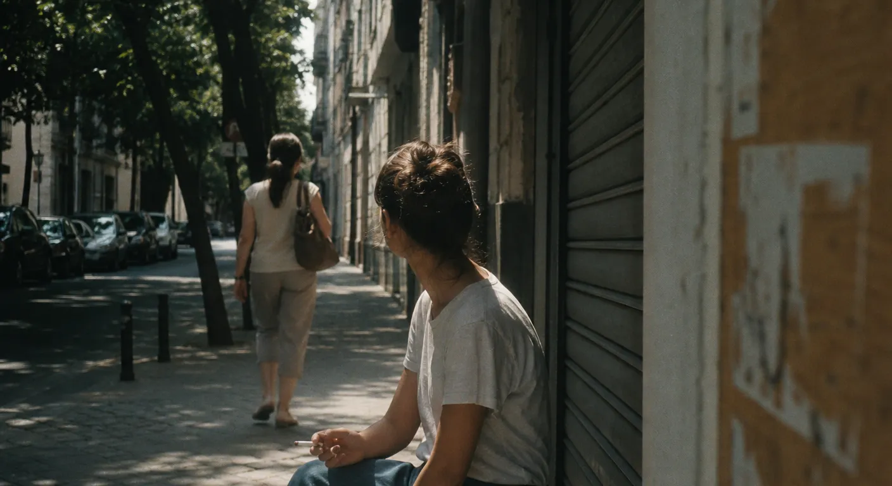

- 适用场景：独立电影、纪实、新好莱坞式粗粝、扎根生活的质感（如《伯德小姐》《天才少女》《亢奋》）。
- 可见元素：明显但有机的颗粒、扎实的颗粒质感、略柔锐度、独立片的"生活感"粗粝、真实不油滑。
- prompt 写法：`16mm 胶片质感Super 16，明显而有机的胶片颗粒，扎实粗粝，略柔锐度，独立电影生活质感`。

### Super 35 胶片（Super 35）

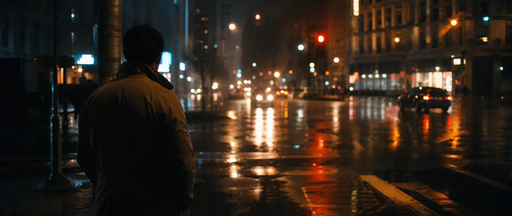

- 适用场景：经典好莱坞正片、商业大片、要"标准电影感"的主力格式。
- 可见元素：细腻紧致的胶片颗粒、丰富色彩、优秀宽容度、柔和高光滚降、油润而有"电影味"的标准质感。
- prompt 写法：`Super 35 胶片质感，细腻紧致胶片颗粒，丰富色彩，柔和高光滚降，标准好莱坞电影质感`。

### 65mm / IMAX 胶片（65mm large format）

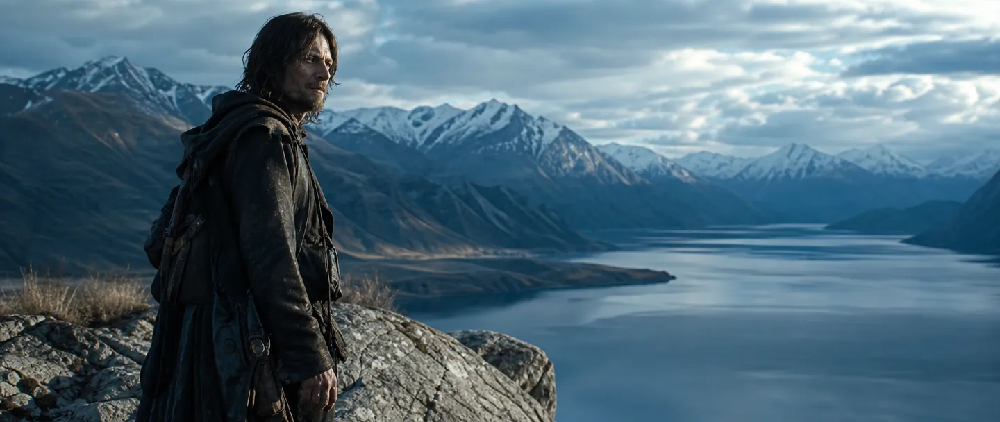

- 适用场景：史诗奇观、震撼风光、大场面巨制（如《沙丘》《奥本海默》《阿拉伯的劳伦斯》）。
- 可见元素：近乎无颗粒、极致清晰、超高细节、浅景深、立体如"蚀刻"般的临场感与宏大规模。
- prompt 写法：`65mm 大画幅胶片质感65mm large format，近乎无颗粒，极致清晰，超高细节，浅景深，立体史诗临场感`。

### ARRI Alexa 数字（ARRI Alexa）

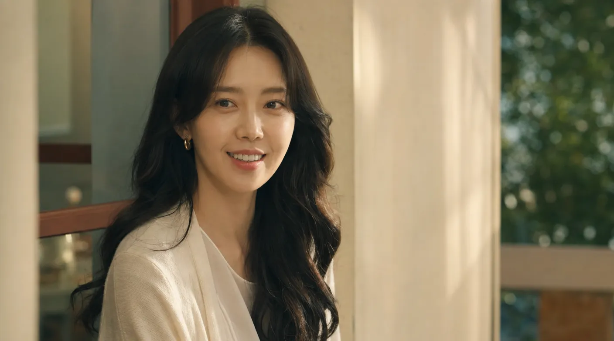

- 适用场景：现代电影、剧集、要"数字拍出胶片味"的温润高级质感。
- 可见元素：温暖奶油的色彩、自然肤色、平滑高光滚降、约 17 档高动态范围、干净却不冰冷的"有机数字感"。
- prompt 写法：`ARRI Alexa 数字摄影质感，温暖奶油色彩，自然肤色，平滑高光滚降，高动态范围，干净有机的电影数字感`。

### RED 数字（RED digital）

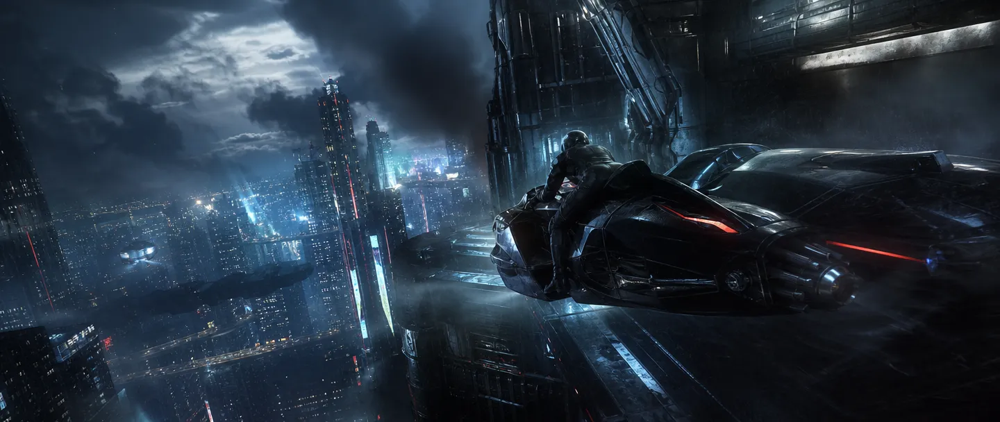

- 适用场景：高科技、动作、特效大片、要锐利通透或冷硬戏剧感的现代数字。
- 可见元素：极高分辨率（8K+）、锐利、暗部偏高对比的戏剧感、色彩浓郁、略冷硬的"纯数字"通透。
- prompt 写法：`RED 数字摄影质感，8K 超高分辨率，锐利通透，暗部高对比戏剧感，浓郁色彩，现代数字感`。

### 数字超清（digital ultra-clean）

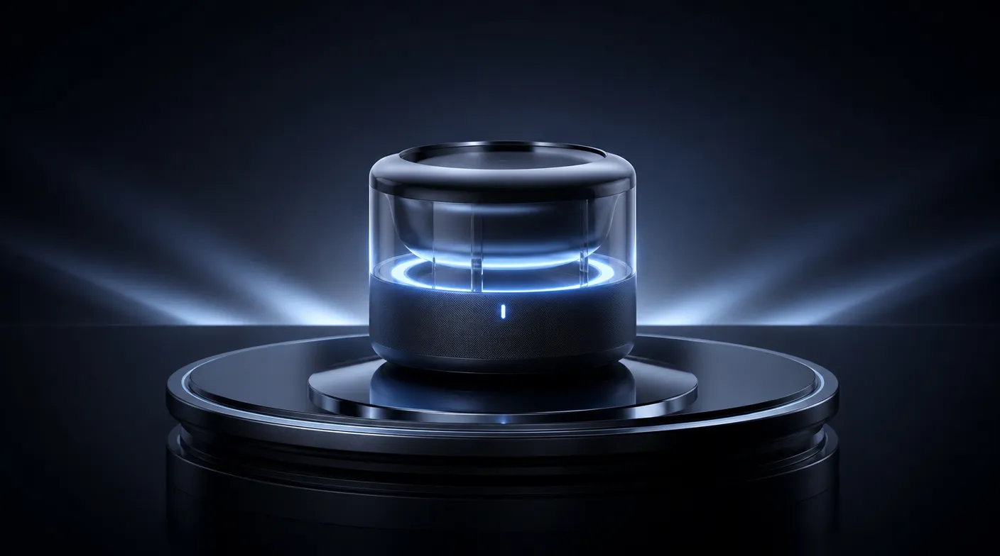

- 适用场景：产品、商业广告、科技演示，要锐利干净的当代商业数字感。
- 可见元素：极高锐度、高动态范围、干净无颗粒、精准色彩、4K/8K 通透清晰、零复古味的当代商业观感。
- prompt 写法：`数字超清拍摄，极高锐度，高动态范围，干净无颗粒，精准色彩，8K 清晰，现代商业质感`。

### 复古录像带 VHS（VHS / video）

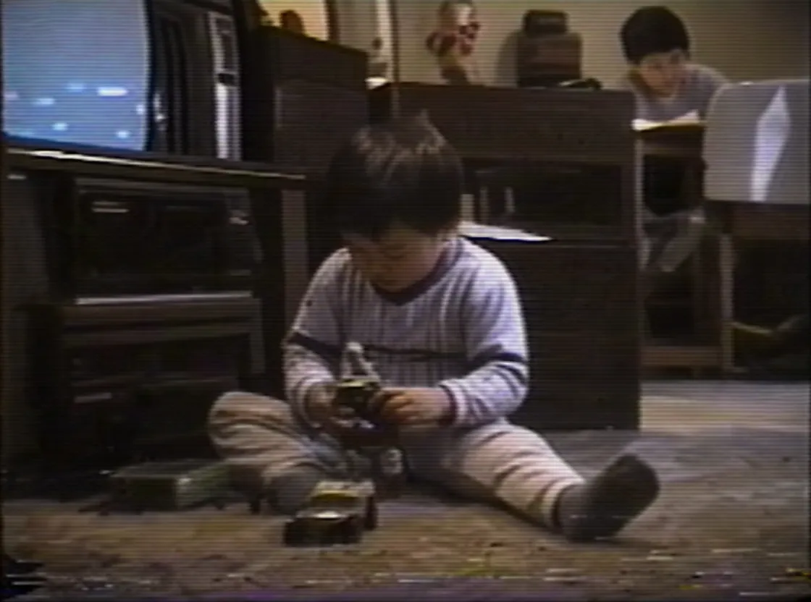

- 适用场景：怀旧、伪纪录、复古 meme、80/90 年代电视感。
- 可见元素：扫描线、色彩溢出、磁带噪点、画面抖动、降低的分辨率、时间码角标、家用录像质感。
- prompt 写法：`复古VHS录像带质感，扫描线，色彩溢出，磁带噪点，画面轻微抖动，低分辨率，怀旧家用录像感`。

---

## 三、镜头光学性格（镜头怎么"看"）

同一格式配不同镜头，画面性格大不同——焦外形状、眩光、锐度、变形都由镜头决定。整片锁定一种镜头取向。

### 变形宽银幕镜头（anamorphic lens）

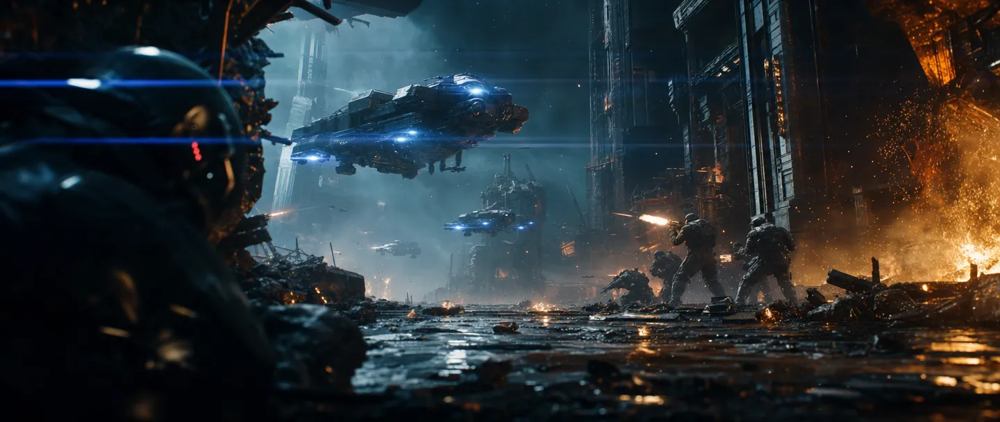

- 适用场景：科幻、动作、史诗，要标志性的"电影感"光学签名。
- 可见元素：横向拉伸的蓝色水平眩光、竖向椭圆焦外光斑、中心锐利边缘渐软、横向压缩的纵深。
- prompt 写法：`变形宽银幕镜头anamorphic lens，横向蓝色水平眩光，竖向椭圆焦外光斑，中心锐利边缘渐软`。

### 球面镜头（spherical lens）

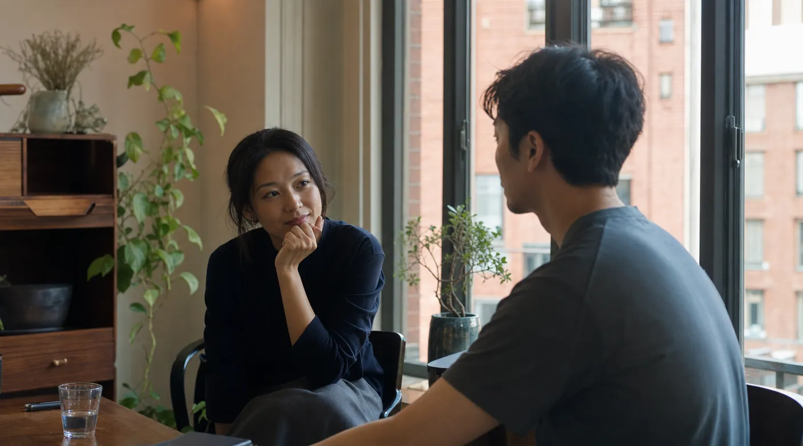

- 适用场景：写实、纪实、亲密剧情，要自然无修饰的中性光学。
- 可见元素：圆形焦外、自然无变形的直线透视、全画面均匀锐利、克制的圆形眩光。
- prompt 写法：`球面镜头spherical lens，圆形焦外bokeh，自然无变形透视，全画面均匀锐利`。

### 复古镀膜镜头（vintage glass）

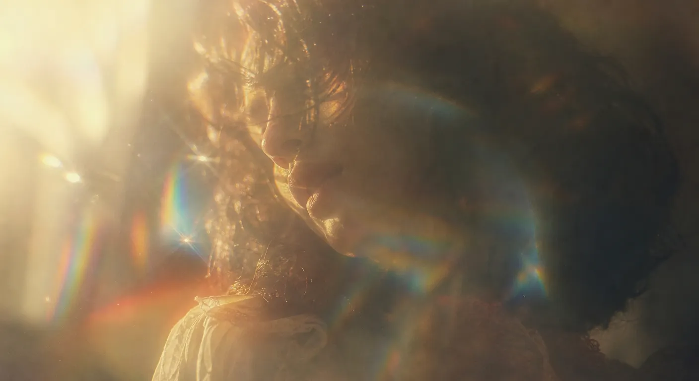

- 适用场景：复古、文艺、梦境、要"有灵魂的瑕疵"质感。
- 可见元素：低对比、起雾般的柔光眩光、彩虹鬼影与星芒、高光晕开bloom、整体柔和富personality。
- prompt 写法：`复古镀膜镜头vintage glass，低对比，柔光起雾眩光，高光晕开bloom，柔和有质感的复古光学`。

### 现代多层镀膜镜头（modern coated）

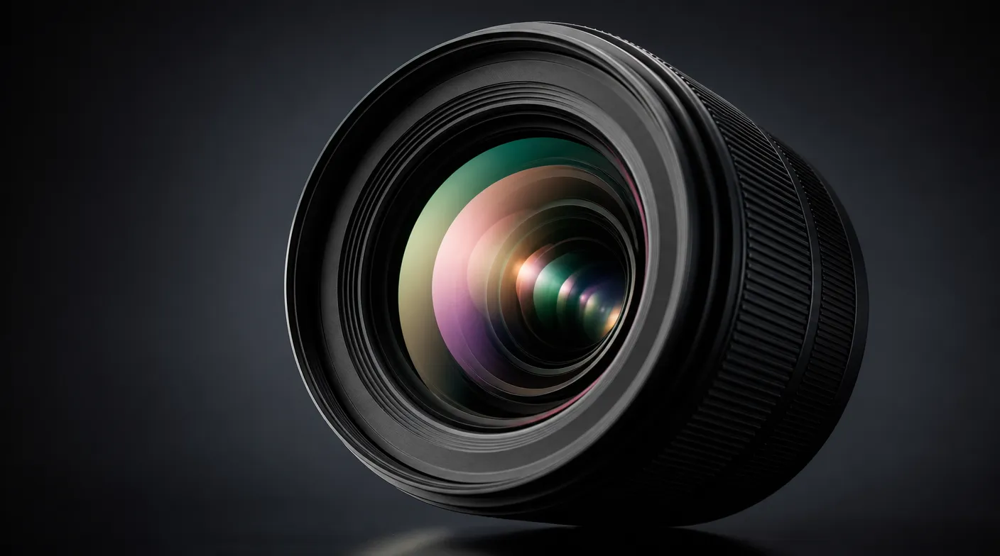

- 适用场景：商业、产品、现代写实，要干净锐利零瑕疵的当代光学。
- 可见元素：高对比、高锐度、极强抗眩光、通透干净、精准无瑕的现代光学表现。
- prompt 写法：`现代多层镀膜镜头，高对比高锐度，强抗眩光，通透干净，精准无瑕的当代光学`。

---

## 四、胶片还是数字质感（介质材质底色）

这一轴管最终落到画面上的"材质感"——有没有颗粒、高光怎么收、有没有光晕。常与拍摄格式呼应，但也可单独叠在数字拍摄上做"数字仿胶片"。

### 原生胶片质感（photochemical film）

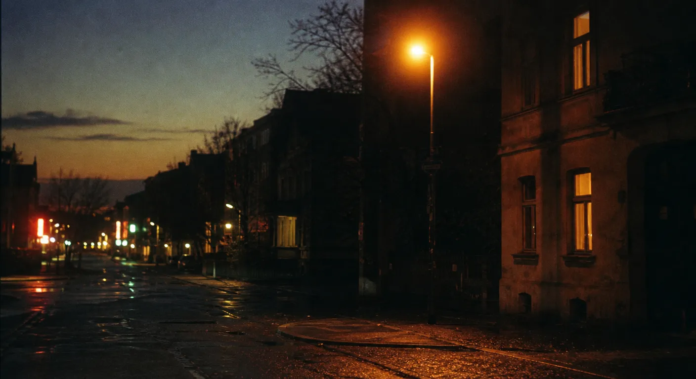

- 适用场景：要纯正胶片的有机质感——颗粒、宽容度、光晕一应俱全。
- 可见元素：银盐随机颗粒、柔和高光滚降不爆、暗部graceful、亮源处红橙光晕halation、大宽容度、有机色彩。
- prompt 写法：`原生胶片质感photochemical，银盐有机颗粒，柔和高光滚降，亮源处红橙光晕halation，大宽容度，有机色彩`。

### 数字干净质感（clean digital）

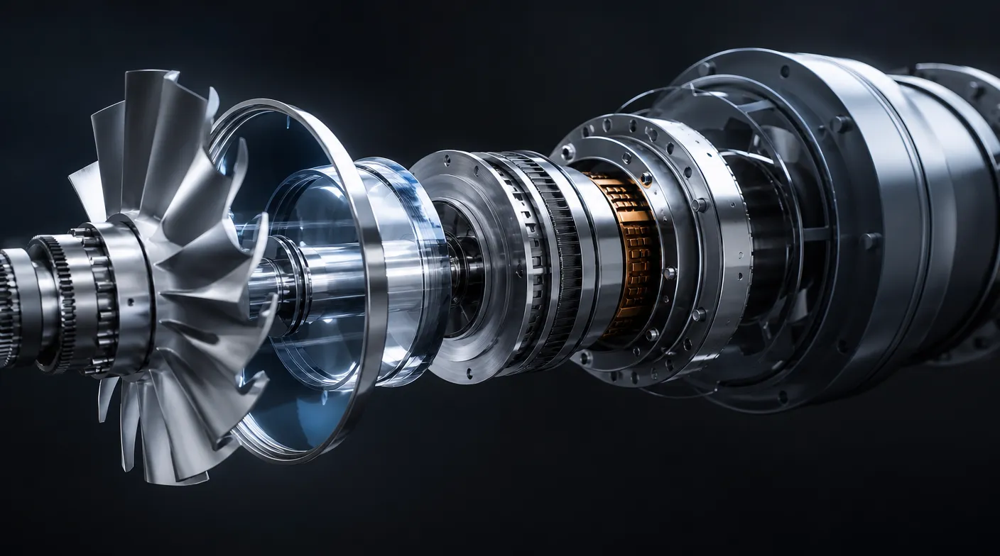

- 适用场景：现代写实、商业，要锐利通透零颗粒的纯数字材质。
- 可见元素：锐利无颗粒、像素级清晰、暗部干净、高光易溢出需控、色彩精准、略"临床"的通透感。
- prompt 写法：`数字干净质感clean digital，锐利无颗粒，像素级清晰，暗部干净，精准色彩，通透现代感`。

### 数字仿胶片质感（film emulation）

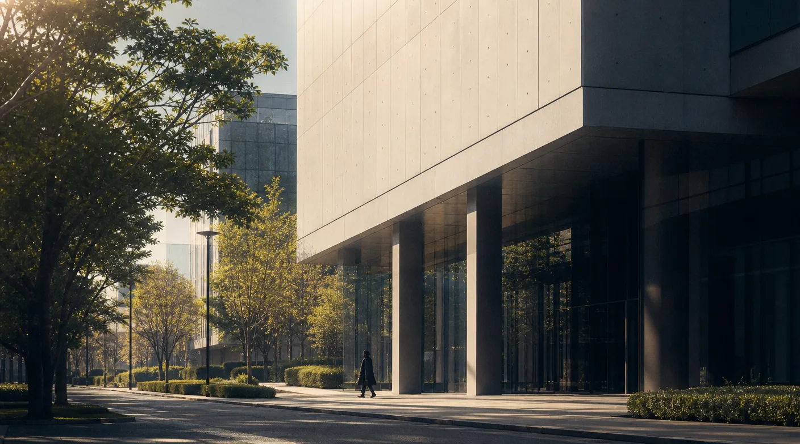

- 适用场景：数字拍摄但要胶片味——当代主流的"鱼与熊掌"折中。
- 可见元素：叠加的胶片颗粒、模拟柔光与高光晕halation、胶片色彩 LUT、S 曲线胶片对比、保留数字的便利与干净基底。
- prompt 写法：`数字仿胶片质感film emulation，叠加胶片颗粒，模拟柔光与高光晕，胶片色彩调色LUT，胶片感对比曲线`。

---

## 精选预设（开箱即用）

从四轴各挑一项叠成的成套视觉基调，覆盖最常见的几类片子。直接整段粘进【氛围与画质】的「视觉基调」槽，再按需微调：

### 史诗大片（IMAX 史诗）

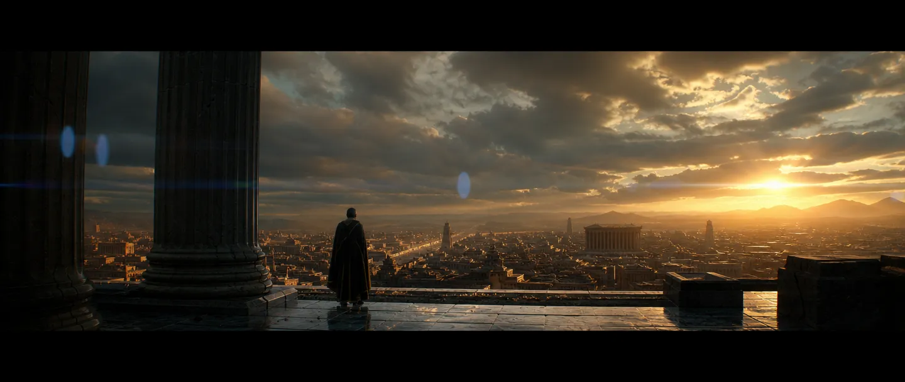

> 整片视觉基调：65mm 大画幅胶片质感65mm large format，2.39:1 超宽银幕画幅，变形宽银幕镜头横向蓝色水平眩光与竖向椭圆焦外，近乎无颗粒、极致清晰、立体如蚀刻的临场感，柔和高光滚降，宏大史诗质感。

- 用于：科幻巨制、战争史诗、震撼风光、大场面动作。

### 文艺胶片（Super 16 独立片）

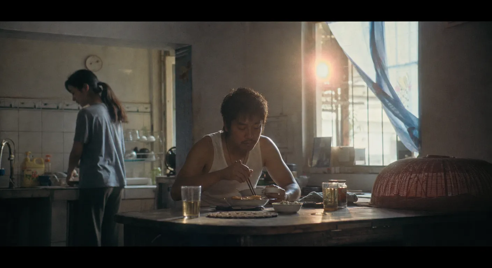

> 整片视觉基调：16mm 胶片质感Super 16，1.85:1 院线宽幕画幅，复古镀膜镜头柔光起雾眩光，明显而有机的胶片颗粒，扎实粗粝、略柔锐度，亮源处红橙光晕halation，扎根生活的独立电影质感。

- 用于：独立剧情、文艺片、纪实风、青春成长。

### 现代商业（数字超清广告）

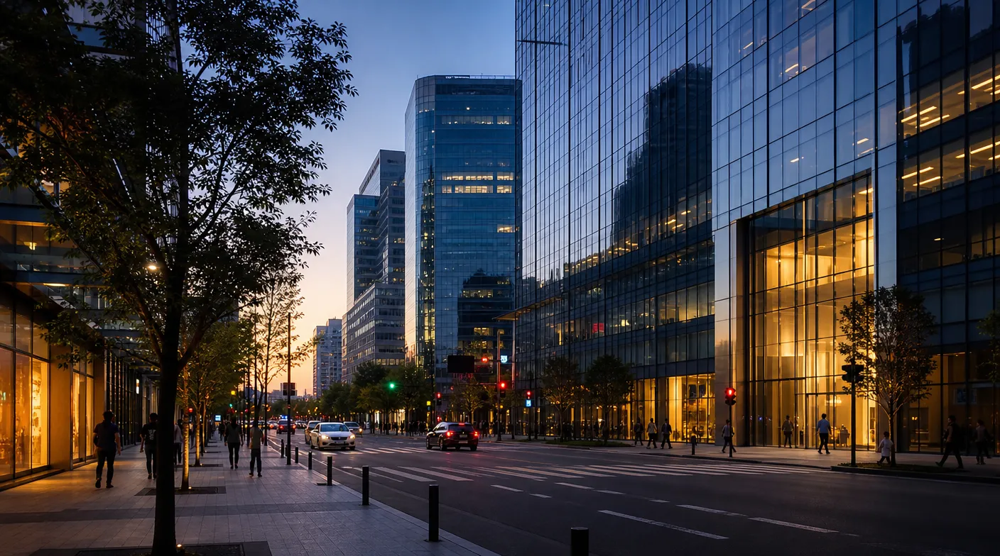

> 整片视觉基调：数字超清拍摄、ARRI Alexa 数字质感，16:9 标准宽屏画幅，现代多层镀膜镜头高对比高锐度，干净无颗粒、高动态范围、精准色彩、平滑高光滚降，通透高级的当代商业质感。

- 用于：产品广告、品牌大片、科技演示、现代都市写实。

### 经典好莱坞（Super 35 正片）

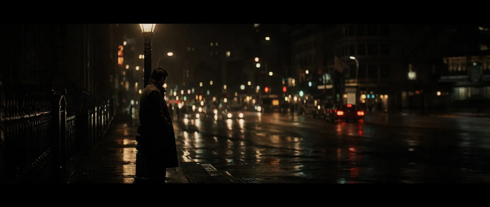

> 整片视觉基调：Super 35 胶片质感，2.39:1 超宽银幕画幅，球面镜头圆形焦外、自然无变形透视，细腻紧致胶片颗粒，丰富色彩，柔和高光滚降，油润标准的经典好莱坞电影质感。

- 用于：商业类型片、剧情长片、要"标准电影感"的通用底色。

### 怀旧回忆（Super 8 录像）

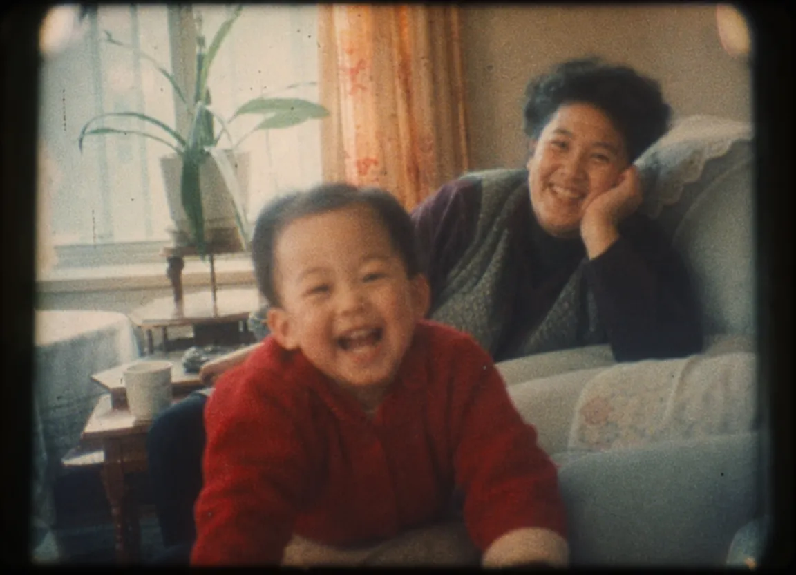

> 整片视觉基调：Super 8 毫米胶片质感，1.37:1 接近方形复古画框，复古镀膜镜头柔光起雾，粗重颗粒、柔软发虚、画面轻微抖动跳格，暖旧偏色，私密怀旧的家庭录像质感。

- 用于：闪回、梦境、回忆段落、lo-fi 复古 meme。

### 竖屏短剧（手机原生）

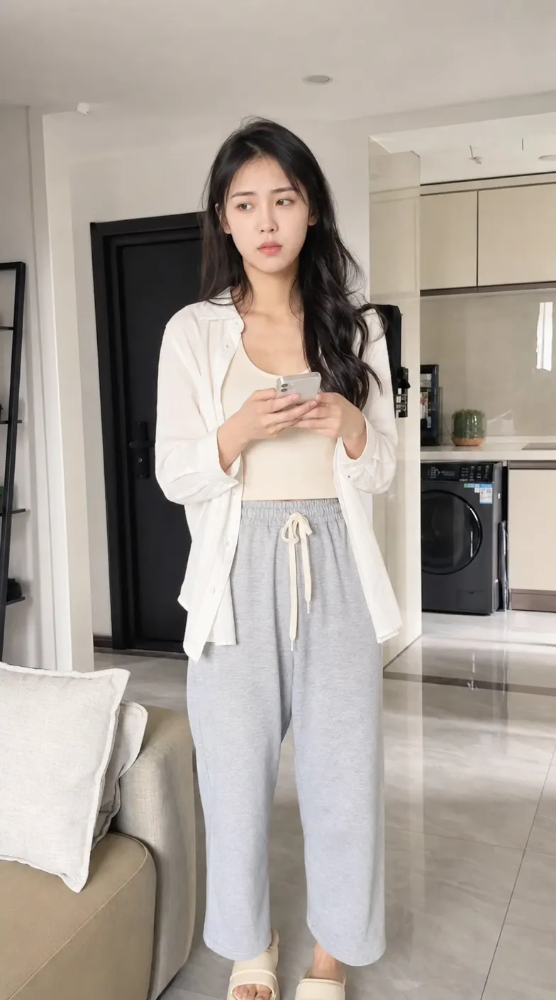

> 整片视觉基调：数字干净质感、轻微手机镜头观感，9:16 竖屏画幅，球面镜头自然透视，锐利无颗粒、暗部干净、自然光，贴近生活的手机原生临场真实感。

- 用于：竖屏短剧、社媒原生内容、口播带货、生活化 vlog。

---

> 三层取用顺序建议：先定「风格核心」（是什么世界，从即梦 94 风格挑，走 `style-core.md`）→ 再定「视觉基调」（像什么机器、什么画幅拍的，本文件四轴叠或直接取精选预设）→ 段落级再换「色彩与影调」（这一场是冷是暖，走 `lighting-tone.md`）。前两层整片锁定一致性，第三层（色彩与影调）负责情绪起伏。
>
> 2D / 3D 风格核心通常无需再叠真人器材类视觉基调（胶片/IMAX 多用于真人写实类），可只锁风格核心一层；竖屏短剧等也可只取「画幅 + 数字干净」两轴，不必凑满四轴。
